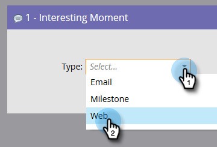
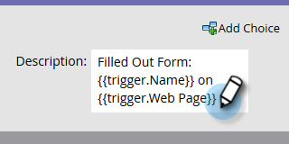

# Make a Campaign Visible to [!DNL Sales Connect] Users {#make-a-campaign-visible-to-sales-connect-users}

Campaigns can only be shared if they're made visible. Here's how to do that.

1. Select (or create) the Campaign you want shared.

   

1. Click the **[!UICONTROL Smart List]** tab.

   

1. Add the [!UICONTROL Campaign is Requested] trigger.

   

1. For source, choose "[!UICONTROL is]" **[!UICONTROL Web Service API]**.

   

1. Click the **[!UICONTROL Flow]** tab.

   

1. Add the [!UICONTROL Interesting Moment] flow action.

   

1. For [!UICONTROL Type], select **[!UICONTROL Web]**.

   

1. In the [!UICONTROL Description] box, write a message to your sales team. In this example we're using tokens to specify the form that was filled out.

   

1. Click the **[!UICONTROL Schedule]** tab and **[!UICONTROL Activate]** the campaign.

   
