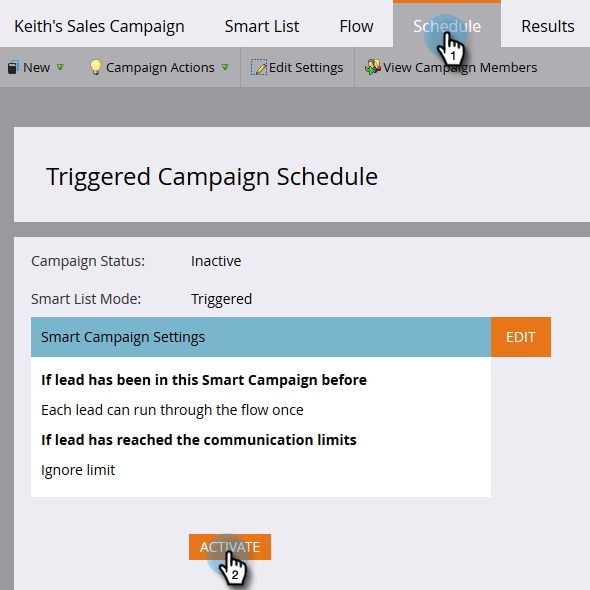

# Make a Campaign Visible to Sales Connect Users {#make-a-campaign-visible-to-sales-connect-users}

Campaigns can only be shared if they're made visible. Here's how to do that.

1. Select (or create) the Campaign you want shared.

   

1. Click the **Smart List** tab.

   

1. Add the Campaign is Requested trigger.

   

1. For source, choose "is" **Web Service API**.

   

1. Click the **Flow** tab.

   

1. Add the Interesting Moment flow action.

   

1. For Type, select **Web**.

   

1. In the Description box, write a message to your sales team. In this example we're using tokens to specify the form that was filled out.

   

1. Click the **Schedule** tab and **Activate** the campaign.

   
