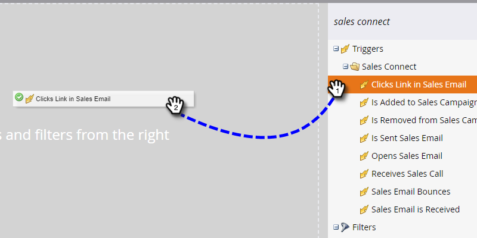
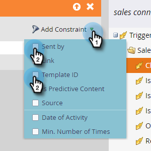

# Sales Activity Triggers and Filters {#sales-activity-triggers-and-filters}

If you're looking to better coordinate engagement with your sales team, or trying to get a better view of how they're engaging with customers across the buyer journey, Sales Activity Insights in Marketo will be useful for you.

Follow the steps below to learn how to utilize sales activity filters and triggers in your smart campaigns.

1. Locate and select your desired Smart Campaign.

   

1. In the **Smart List** tab, search “Sales Connect.”

   

1. Select the desired filter or trigger.

   

1. Select any desired constraints.

   

>[!NOTE]
>
>For a full list of activities, constraints, and definitions check out our [Sales Activity Glossary](/help/marketo/product-docs/marketo-sales-connect/marketo/sales-activity-glossary.md).
