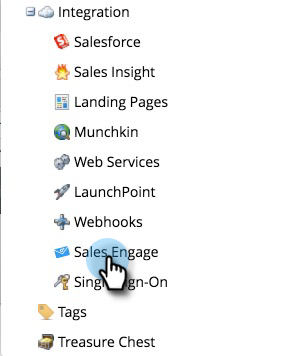

# Set up Your Marketo Connection {#set-up-your-marketo-connection}

>[!NOTE]
>
>When you provision MSC, Marketo will automatically send your credentials to [!DNL Sales Connect] and connect your instance to Marketo. This step is required **only if you are not seeing the connection established** after your [!DNL Sales Connect] instance is provisioned. If your connection is established you will see your credentials entered on the Marketo Admin Settings page.

## Acquiring Credentials Prior to Connecting [!DNL Sales Connect] with Marketo {#acquiring-credentials-prior-to-connecting-sales-connect-with-marketo}

You'll need to get a set of credentials from within Marketo. These credentials will be used later by the [!DNL Sales Connect] Admin to connect Marketo with [!DNL Sales Connect].

1. In Marketo, click **[!UICONTROL Admin]**.

   

1. In the tree, click **[!UICONTROL Sales Engage]**.

   

1. Select and send the following Marketo credentials to your [!DNL Sales Connect] Admin: [!UICONTROL Munchkin Account ID], [!UICONTROL Client ID], [!UICONTROL Client Secret].

   

   >[!NOTE]
   >
   >When you copy and paste the above info, make sure no spaces get added.

## Connect [!DNL Sales Connect] to Marketo {#connect-sales-connect-to-marketo}

1. In [!DNL Sales Connect], click the gear icon and select **[!UICONTROL Settings]**.

   

1. Under [!UICONTROL Admin Settings], select **[!UICONTROL Marketo]**.

   

1. Input the Marketo credentials provided by the Marketo Admin and click **[!UICONTROL Connect]**.

   
