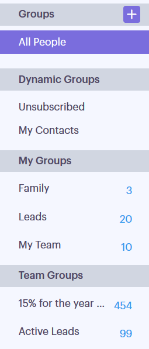
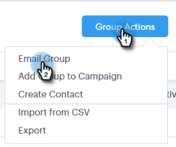
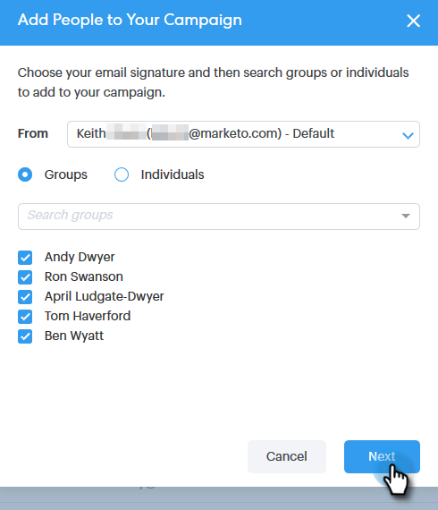
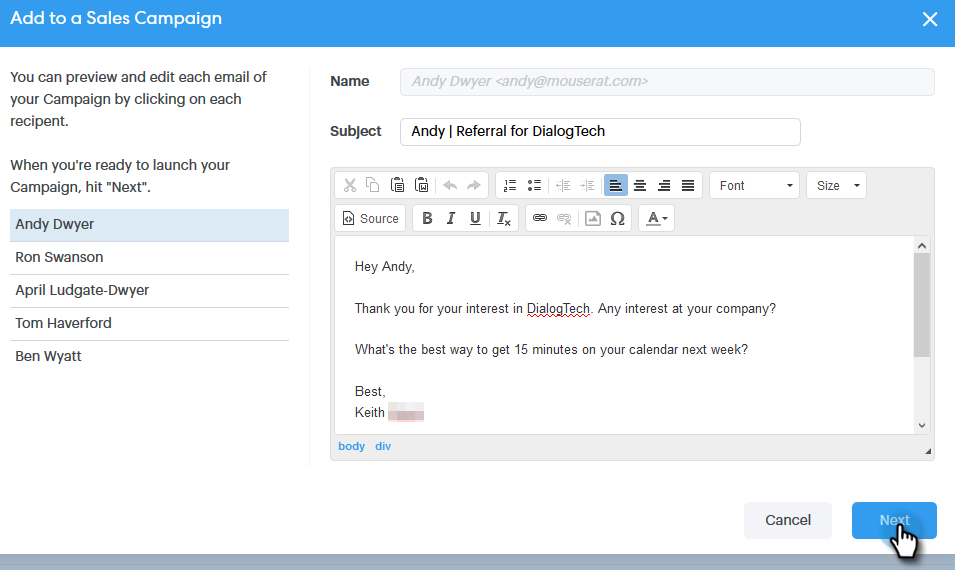

# Connecting with a Group {#connecting-with-a-group}

Learn how to send an email to an entire group, or add a group to a campaign.

## Group Action: Email {#group-action-email}

1. Select the group you'd like to email.

   

1. Click the **Group Actions** button and select **Email Group**.

   

1. Fill out your email and schedule/send it.

   

   And that's it. Everyone in that group will receive the email.

## Group Action: Add to Sales Campaign {#group-action-add-to-sales-campaign}

1. Select the group you'd like to add to a campaign.

   

1. Click the **Group Actions** button and select **Add Group to Campaign**.

   

1. Confirm the right people have been selected and click **Next**.

   

   >[!NOTE]
   >
   >You may see an option to add to a Marketo Campaign. [That's a different article](/help/marketo/product-docs/marketo-sales-connect/campaigns/add-to-marketing-campaign.md).

1. Select a campaign (you can select a category to narrow your results) and click **Next**.

   

1. Make any edits you'd like and click **Next**.

   

1. Schedule the campaign and click **Start**.

   
