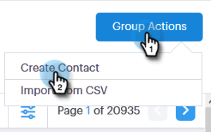

# Creating and Deleting Contacts {#creating-and-deleting-contacts}

## Creating Contacts {#creating-contacts}

1. In the [!UICONTROL People] page, click the **[!UICONTROL Group Actions]** button and select **[!UICONTROL Create Contact]**.

   

1. Enter the first/last name and email address, along with any other info you'd like. Click **[!UICONTROL Create]** when done, or **[!UICONTROL Create and Add New]** to add more contacts.

   

   >[!TIP]
   >
   >Want to add multiple contacts at once? [Click here](/help/marketo/product-docs/marketo-sales-connect/people/managing-contacts/import-contacts-via-csv.md) to learn how to import contacts via CSV.

## Deleting Contacts {#deleting-contacts}

1. In the [!UICONTROL People] page, check the box of the contact you’d like to delete.

   

   >[!NOTE]
   >
   >To delete multiple contacts, simply select multiple people. The remaining steps would be the same.

1. Click the dota (three vertical dots) and select **[!UICONTROL Delete]**.

   

1. Click **[!UICONTROL Delete Contact]** to confirm.

   
