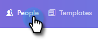
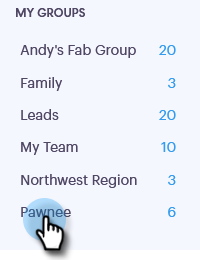
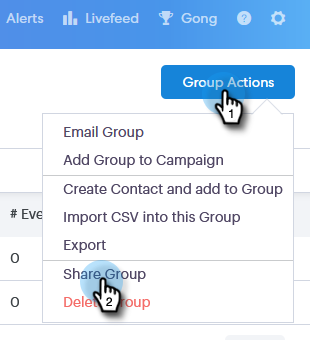
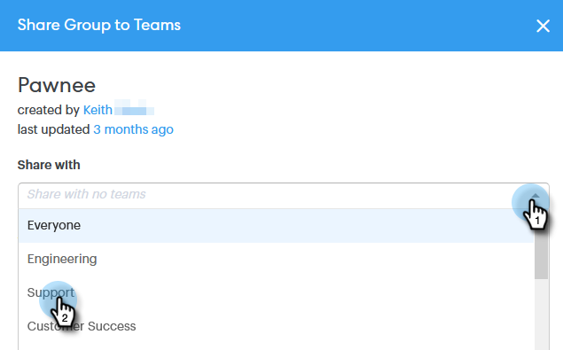
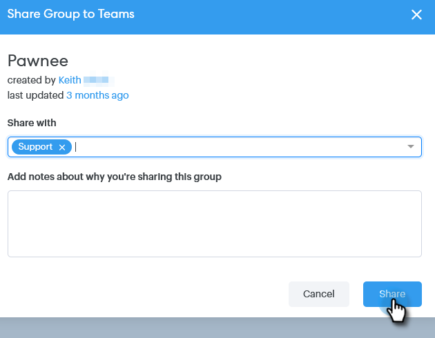

# How to Share a Group {#how-to-share-a-group}

Sharing a group of leads or contacts with your team is pretty simple in Sales Connect.

1. Go to the **People** tab.

   

1. Select the Group you want to share.

   

1. Click the** Group Actions** button and select **Share Group**.

   

1. Select the Subteam you want to share with and add a note for your team.

   

1. Click **Share**.

   

