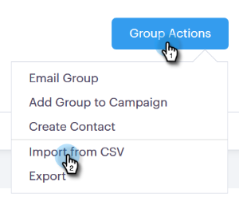
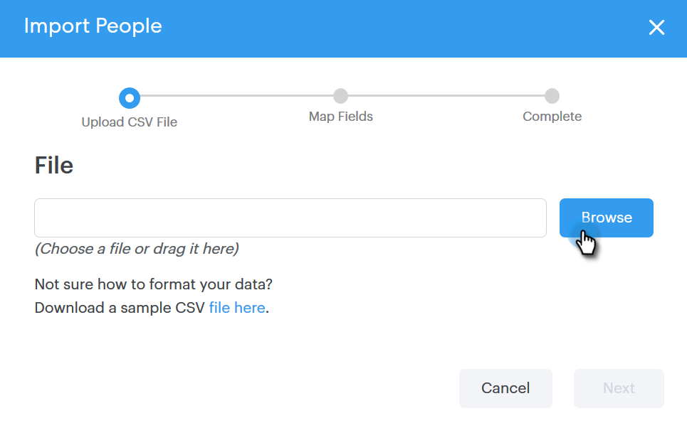
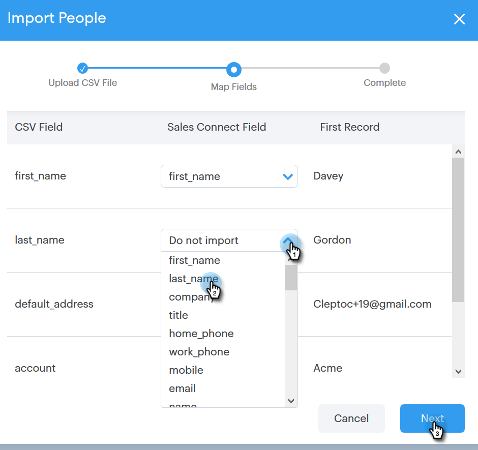

# Import Contacts via CSV {#import-contacts-via-csv}

Having contacts in the [!UICONTROL People] page is important because it's where we pull from to auto-fill personalized information in the dynamic fields in your templates. Make sure you have at least a name and an email address for each contact in your CSV and that you map to those fields.

1. Select your group (or create a new one) in the [!UICONTROL People] tab.

   

1. Click **[!UICONTROL Group Actions]** and select **[!UICONTROL Import from CSV]**.

   

1. Click **[!UICONTROL Browse]**.

   

1. Locate the file on your computer and select it.

   >[!NOTE]
   >
   >Groups are limited to 1000 contacts.

1. Click **[!UICONTROL Next]**.

   

1. Map the columns in your CSV to their respective fields in [!DNL Sales Connect]. Click **[!UICONTROL Next]** when done.

   
