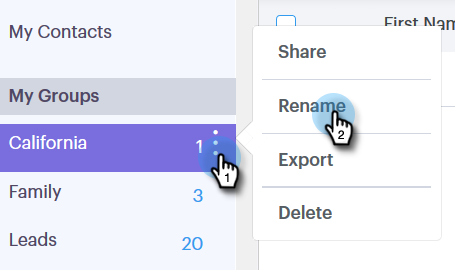

# Manage Groups {#manage-groups}

Manage Groups - Marketo Docs - Product Documentation

Learn how to manage your groups in Sales Connect.

### What's in this article? {#whats-in-this-article}

[Create a Group](#create-a-group)  
[Add Contacts to a Group](#add-contacts-to-a-group)  
[Share a Group](#share-a-group)  
[Unshare a Group](#unshare-a-group)  
[Rename a Group](#rename-a-group)  
[Delete a Group](#delete-a-group)

#### Create a Group {#create-a-group}

1. In the People page, click the **plus sign** next to Groups.

   

1. Name your group and click **Create**.

   

   That's it!

#### Add Contacts to a Group {#add-contacts-to-a-group}

1. In the People page, find and select the group you want to add people to.

   

1. Click **Group Actions** and select **Create Contact**.

   

   >[!NOTE]
   >
   >This will add one contact at a time. To add multiple contacts at the same time, follow [these steps](http://docs.marketo.com/x/VADb).

1. Fill out the contact's information and click **Create** (or **Create and Add New** to add another).

   

   And you're done!

   >[!NOTE]
   >
   >You might have to hit refresh to see any new contacts added.

#### Share a Group {#share-a-group}

1. In the People page, find and select the group you want to share.

   

1. Click the dota (three vertical dots) and select **Share**.

   

1. Click the drop-down and choose the team you want to share the group with.

   

1. Click **Share**.

   

   You still own the group, but it will now appear under Team Groups.

#### Unshare a Group {#unshare-a-group}

1. In the People page, find and select the group you want to unshare.

   

1. Click the dota (three vertical dots) and select **Share**.

   

1. Click the **X** next to the team you shared the group with, then click out of the modal.

   

   The group is now unshared.

#### Rename a Group {#rename-a-group}

1. In the People page, find and select the group you want to rename.

   

1. Click the dota (three vertical dots) and select **Rename**.

   

1. Type in the new name and hit enter.

   

#### Delete a Group {#delete-a-group}

1. In the People page, find and select the group you want to delete.

   

1. Click the dota (three vertical dots) and select **Delete**.

   

1. Click **Delete** to confirm.

   

