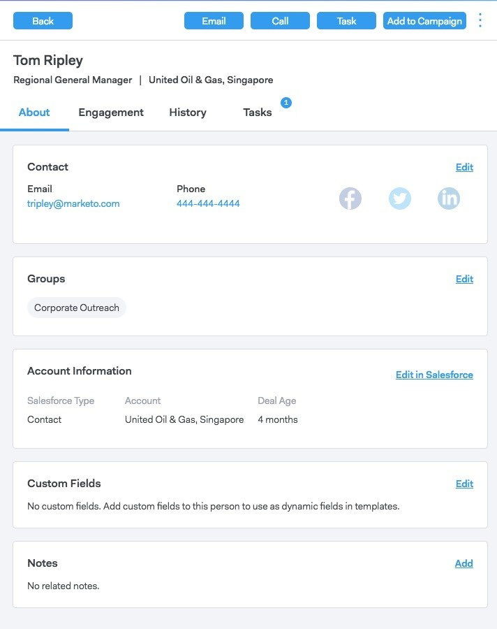
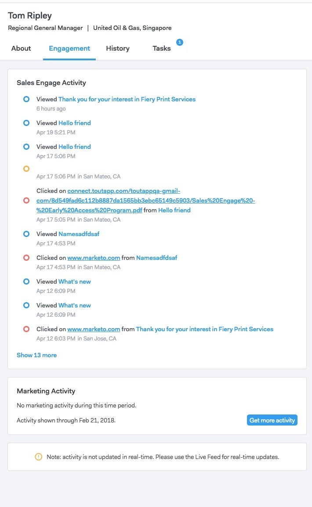
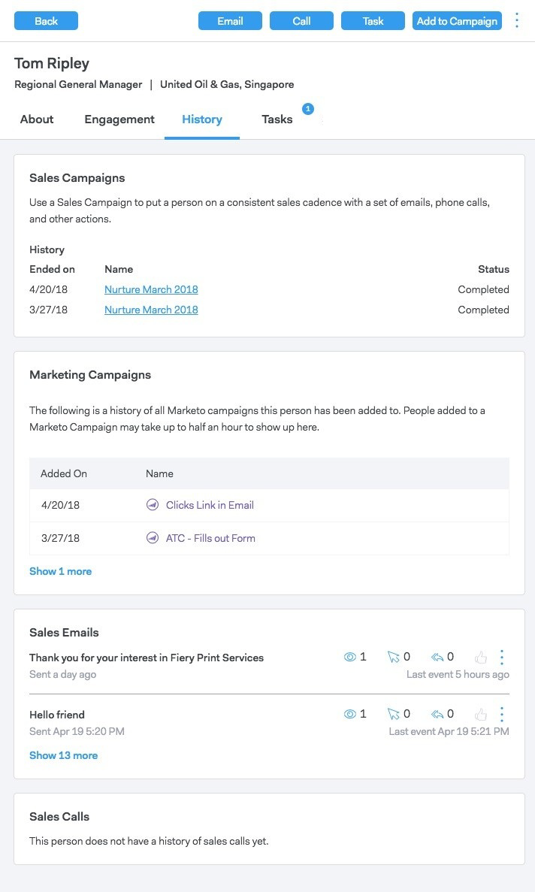
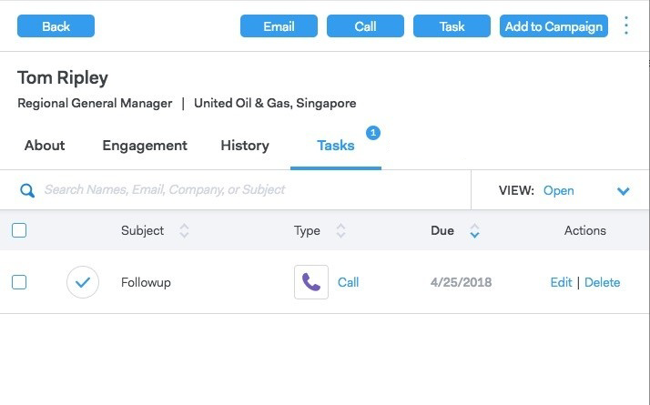

# Person Detail View {#person-detail-view}

Person detail view provides a detailed profile of each person in your MSC account.

## How to Access {#how-to-access}

1. To access the person detail view, click the **People** tab.

   

1. Click on the desired person.

   

   >[!TIP]
   >
   >Pretty much anywhere you see a person's name, you can click on it and get to their Person Detail View.

## About Tab {#about-tab}

Includes all of the person's contact information.

**Contact Card**

* Contains contact information like: email address, name, company, title, phone number, and social media links

**Groups**

* Displays and manages what groups this person is a member of

**Account Information**

* Can add a person to Salesforce
* Pull account and lead/contact information from Salesforce

**Custom Fields**

* Add or remove custom fields that can be used as dynamic fields in your templates and campaigns

**Notes**

* Create custom notes

## Engagement Tab {#engagement-tab}

See how this person is engaging with your outreach.

**Sales Connect Activity**

* See engagement activities from your sales emails and campaigns

**Marketing Activity**

* See how your person is engaging with marketing campaigns

## History Tab {#history-tab}

Shows your outreach history. Includes emails, campaigns, and calls.

**Sales Campaigns**

* See any active or completed campaigns this person belongs to

**Marketing Campaigns**

* See any marketing campaigns this person is a member of

**Sales Emails**

* See any emails you've sent this person and the engagement metrics

**Sales Calls**

* See any calls you've made to this person

## Tasks Tab {#tasks-tab}

Manage tasks associated with this person.

Actions you can perform:

* Edit or delete a task
* See the due date
* Click on the Type to launch the Sales Phone if Call, Email Compose if Email, Linkedin if Inmail, and Custom Note if Custom.
* Mark a task as complete
