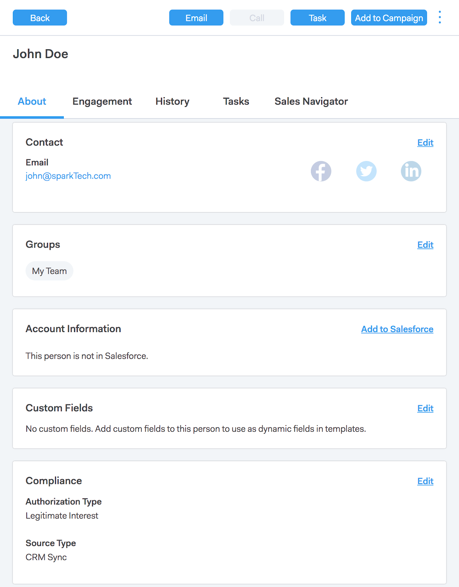
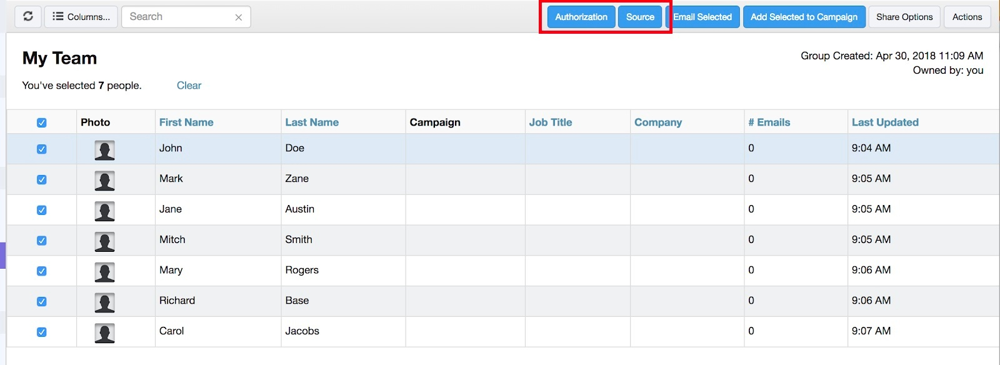
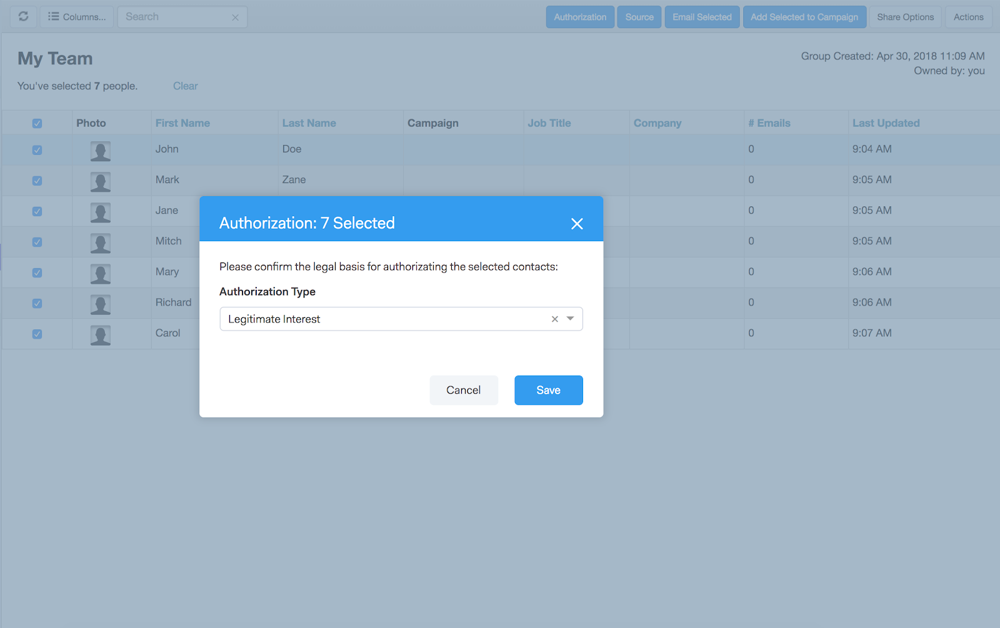
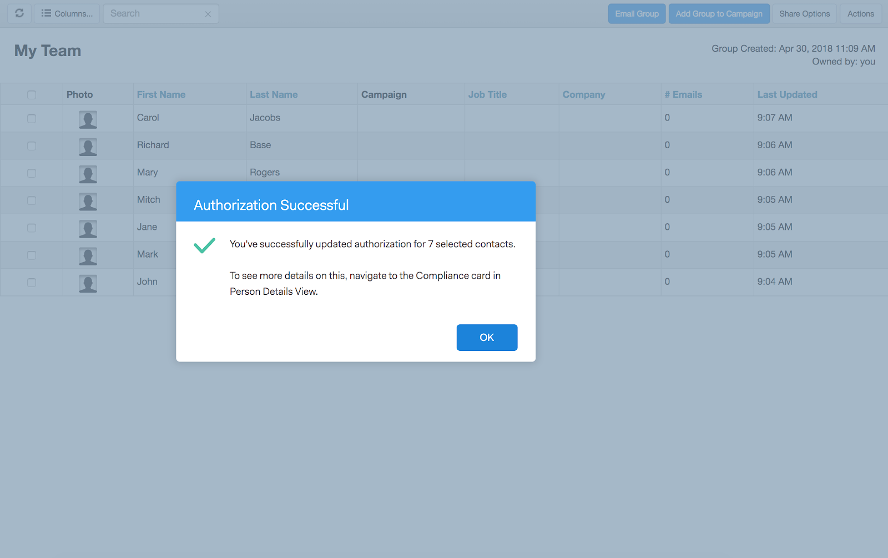
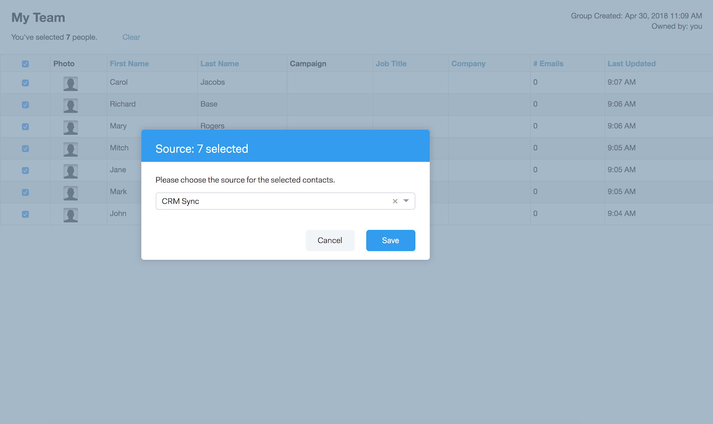
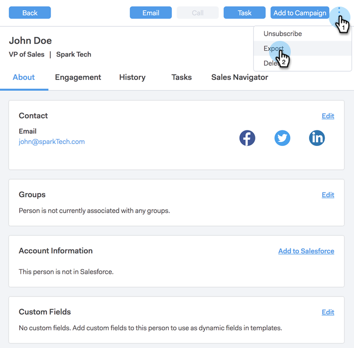

# Sales Connect and GDPR Compliance {#sales-connect-and-gdpr-compliance}

The General Data Protection Regulation (GDPR) is European Union legislation that went into effect on May 25, 2018.

## Overview {#overview}

Its aim is to strengthen the rights of data subjects within the European Union (EU) and European Economic Area (EEA) with regard to how their personal data is used and protected. “Personal data” refers to any information that relates to an identified or identifiable natural person.
  
The GDPR is structured around six key principles (detailed in Article 5 of the legislation):

1. Transparency on how data will be used and what it will be used for.
1. Ensuring that the data collected is used only for the purposes explicitly specified at the time of collection.
1. Limiting the data collection to what is necessary to serve the purpose for which it is collected.
1. Ensuring the data is accurate.
1. Storing the data for only as long as necessary within its intended purpose.
1. Prevention against unauthorized use or accidental loss of the data through the deployment of appropriate security measures.

In addition, there's a new accountability requirement to be able to demonstrate how compliance is being managed and tracked. This means maintaining records of how and why personal data was collected as well as the documentation of the processes put in place to protect it.

## To Whom Does it Apply? {#to-whom-does-it-apply}

The GDPR applies to any organization inside or outside the EU who is marketing goods or services to, and/or tracking the behaviors of, data subjects within the EU and EEA. If you do business with data subjects in Europe that involves the processing of their personal data, this legislation applies to you. Penalties for non-compliance are significant, with large fines for those in breach of the regulation; the maximum fine for a single breach is €20 million or 4% of annual worldwide turnover, whichever is greater.

## Implications for Marketing {#implications-for-marketing}

Marketers aim to create customer experiences that feel personal and human, founded on trust and delivered with care. Though the GDPR doesn’t use these terms, the goals are the same—to respect the rights of customers and to earn their trust. To build and maintain that trust, marketers must be attuned to the how, when, and why their customers want to be engaged. It's critical that customer preferences are respected, not only as a legal requirement, but as the foundation of customer-focused engagement practices.  
  
How marketers address these higher expectations around the collection, use, and security of the personal data that are routinely used in the course of their work is key, and Marketo can help with meeting those expectations.

There are two key aspects of the GDPR where marketers needs to review past, current, and future practices. The first is consent by the individual to process their personal data, and the second is accountability, namely being able to demonstrate how the principles of the GDPR are being followed.  
  
We provide extensive information around consent and accountability within the Marketo platform in our e-book, [GDPR and The Marketer](https://www.marketo.com/ebooks/the-gdpr-and-the-marketer/). In this article, however, we will focus specifically on the new features in Marketo Sales Connect that will help your organization adhere to GDPR rules.

## GDPR Compliance in Marketo Sales Connect {#gdpr-compliance-in-marketo-sales-connect}

Marketo Sales Connect is a powerful application—part of the Marketo Engagement Platform—that provides a single workflow and view for sales and marketing to collectively drive pipeline faster through collaborative engagement. New functionality in Marketo Sales Connect has been created specifically with GDPR compliance in mind. We will outline all three functions and explain how they, when used properly, will help your organization’s GDPR compliance efforts.

## Compliance Card {#compliance-card}

Marketo Sales Connect includes a Compliance Card in the Person Detail View to provide key information on a contact’s Authorization Type, as well as their Source Type. This allows users to easily add and track information critical to data privacy, and helps them make more informed decisions on campaign/outreach strategy.

Contact Authorization Type

Within the Compliance Card, users can track the legal basis for processing a contact’s personal data through the Authorization drop-down. Understanding a contact’s authorization type helps Marketo Sales Connect users make more informed decisions regarding outreach practices, ensuring that each campaign or engagement is legal and appropriate.  
  
Users have numerous options to choose from, including:

* Consent
* Legitimate Interest
* Performance of a Contract
* Compliance with Legal Obligation
* Protection of Vital Interests
* Public Interest/Official Authority
* Other

Contact Source Type

Within the new Compliance Card, users can track the source of a contact. The Source Type defines where a contact’s information came from when initially uploaded into Marketo Sales Connect. Understanding a contact’s source type also helps with decisions regarding outreach practices, as well as determining which other systems or locations personal data is stored, ensuring that each engagement is in-line with GDPR legislation.  
  
Again, users have numerous drop-down options to choose from, including:

* CRM Sync
* Import
* Manual Upload
* Chrome Extension
* Other

Editing the Compliance Card

When the Person Detail View is open, click **Edit** in the Compliance Card.

  
You will see two drop-downs: Authorization Type and Source Type.  
  

  
If you choose “Consent” as the Authorization Type, two mandatory fields: “Date of Consent” and “Purpose of Processing” will appear. These two fields are not applicable to other options.

  
If “Other” is chosen for either Authorization Type or Source Type, you may enter text to describe the Source Type.

  
Bulk Actions** Marketo Sales Connect also allows for updating a contact’s Authorization and Source types in bulk, saving valuable time in the compliance process.  
  
When you select one or more contacts from the People page, Authorization and Source buttons show up in the top container. Using these buttons, you can set the Authorization or Source of multiple contacts simultaneously.

When you click on the Authorization modal, a pop-up with drop-down options that match the ones in the Compliance Card appears.

After the Authorization Type is updated, you'll receive a confirmation pop-up, and you'll be able to see the updated details in the Compliance Card in the Person Detail View.

Similarly, the Source Type may be updated in bulk as well by clicking the Source modal.

After selecting the correct Source Type for your selected contacts, a confirmation window will appear to confirm the successful update.

## Exporting Contact Data From Marketo Sales Connect {#exporting-contact-data-from-marketo-sales-connect}

You have the ability to export contact information from the Person Detail View. Exporting will download a .CSV file with the following columns:

<table> 
 <colgroup> 
  <col> 
  <col> 
  <col> 
 </colgroup> 
 <tbody> 
  <tr> 
   <td>First Name</td> 
   <td>Website</td> 
   <td>Facebook</td> 
  </tr> 
  <tr> 
   <td>Last Name</td> 
   <td>Other</td> 
   <td>Twitter</td> 
  </tr> 
  <tr> 
   <td>Company</td> 
   <td>Updated At</td> 
   <td>LinkedIn</td> 
  </tr> 
  <tr> 
   <td>Title</td> 
   <td>Created At</td> 
   <td>Exported At</td> 
  </tr> 
  <tr> 
   <td>Email ID</td> 
   <td>Salesforce ID</td> 
   <td> </td> 
  </tr> 
  <tr> 
   <td>Phone Number</td> 
   <td>Person ID</td> 
   <td> </td> 
  </tr> 
 </tbody> 
</table>

>[!NOTE]
>
>This can only be done one contact at a time. There is currently no functionality allowing bulk exports of contacts.

To export contact information, click the three vertical dots in the Person Detail View Header and select **Export**. The .CSV file will automatically download.

>[!NOTE]
>
>The GDPR also requires the ability to delete contacts from the UI, but Marketo Sales Connect already possesses this functionality.

## Unsubscribes {#unsubscribes}

One commonly misunderstood area of GDPR involves contacts that unsubscribe from the organization’s database. In order to adhere to new rules around protecting the data of those who choose to unsubscribe, the following functionality has been included in Marketo Sales Connect:  
  
**Unsubscribe Links:** Unsubscribe links will be automatically appended to all emails sent from the Sales Connect web application to ensure that contacts are given an accessible way to opt-out.  
**Unsubscribe Sync:** Users can sync unsubscribes to and from their CRM (Salesforce) to ensure that opt-outs are up-to-date.  
**Unsubscribe History:** Users can see historical opt-outs and opt-ins in the Person Detail View.  
**Unsubscribe Removal:** Opting an unsubscribed contact back in requires the user to have admin privileges and to demonstrate that the contact has given new consent to contact them.

## Future Updates {#future-updates}

As an enthusiastic advocate of the power and customer-centricity of the engagement economy, Marketo understands the importance of putting privacy and data protection in the hands of the data subject. As with other data protection laws, GDPR compliance requires commitment from both Marketo and our customers. This article is intended to help you use Marketo in an appropriate way to support your organization’s GDPR compliance.
  
We will continue to closely track applicable GDPR guidance issued by regulatory authorities and related legislation. Updates will be posted to our Trust Center at [trust.marketo.com](https://trust.marketo.com).
