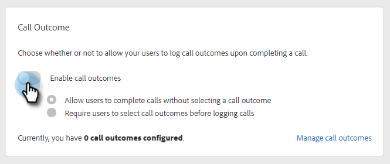
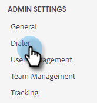
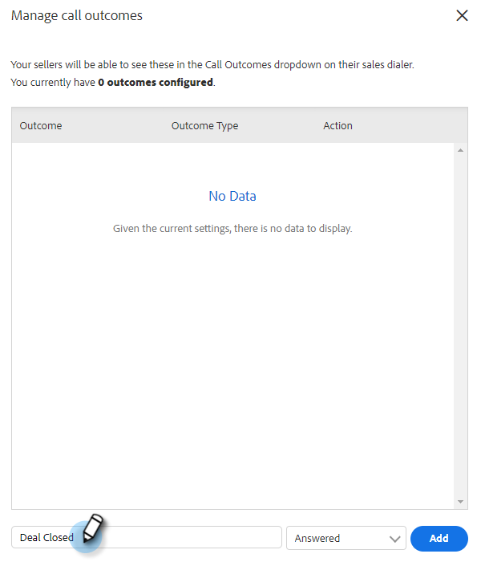
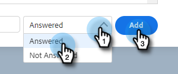

# Call Outcomes {#call-outcomes}

Allow your sales teams to select call outcomes when making calls so your team can understand the impact of your customer engagement efforts.

>[!NOTE]
>
>**Admin permissions required.**

## Enable Call Outcomes {#enable-call-outcomes}

1. Click on the gear icon and select **Settings**.

   

1. Under Admin Settings select **Dialer**.

   

1. Select **Enable Call Outcomes**.

   

1. Choose your desired call outcome requirement.

   

## Create Call Outcomes {#create-call-outcomes}

1. Click on the gear icon and select **Settings**.

   

1. Under Admin Settings select **Dialer**.

   

1. Click **Manage Call Outcomes**.

   

1. Enter your desired call outcome name into the text field.

    

1. Click the Answered drop-down and choose the outcome type (in this example we're choosing Answered). Then click **Add**.

   

## Choose a Call Outcome {#choose-a-call-outcome}

Once call outcomes have been enabled. Users can select one while making a call.  

1. Click the call button to launch the dialer.

PICC

1. Enter the call information in the dialer.

PICC

1. Click call.

PICC

1. Select the call outcome that best describes the call.

PICC

1. End the call.

PICC

1. Log the call.

PICC

>[!MORELIKETHIS]
>
>* [Log Call Reasons and Call Outcomes to Salesforce](/help/marketo/product-docs/marketo-sales-connect/phone/log-call-reasons-and-call-outcomes-to-salesforce.md)
>* [Call Reasons](/help/marketo/product-docs/marketo-sales-connect/phone/call-reasons.md)