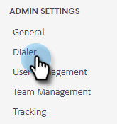
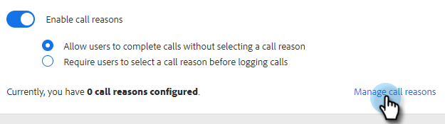
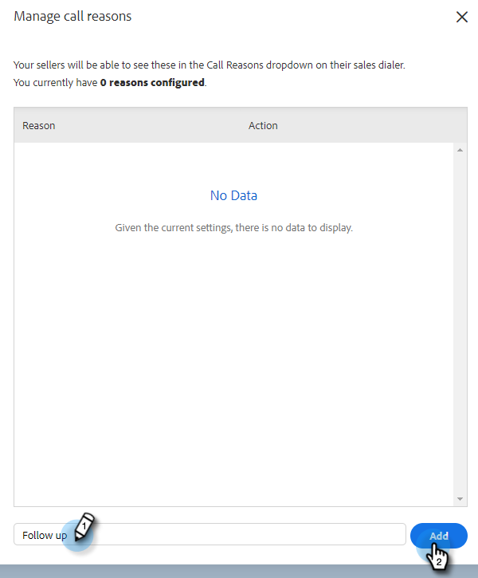
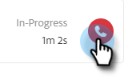

# Call Reasons {#call-reasons}

Allow your sales teams to select call reasons when making calls so your team can understand the why calls are being made.

>[!NOTE]
>
>**Admin permissions required**

## Enable Call Reasons {#enable-call-reasons}

1. Click on the gear icon and select **[!UICONTROL Settings]**.

   

1. Under [!UICONTROL Admin Settings] select **[!UICONTROL Dialer]**.

   

1. Select **[!UICONTROL Enable call reasons]**.

   

1. Choose your desired call reason requirement.

   

## Create Call Reason {#create-call}

>[!NOTE]
>
>You can create a maximum of 15 Call Reasons.

1. Click on the gear icon and select **[!UICONTROL Settings]**.

   

1. Under [!UICONTROL Admin Settings] select **[!UICONTROL Dialer]**.

   

1. Click **[!UICONTROL Manage call reasons]**.

   

1. Enter your desired call reason name into the text field and click **[!UICONTROL Add]**.

   

## Select a Call Reason {#select-a-call-reason}

Once call reasons have been enabled. Users can select one while making a call.

1. Click the call button to launch the dialer.

   

1. Enter the call information in the dialer and click **[!UICONTROL Call]**.

   

1. Select the call reason that best describes the call.

   

1. End the call.

   

1. Log the call.

   

>[!MORELIKETHIS]
>
>* [Log Call Reasons and Call Outcomes to Salesforce](/help/marketo/product-docs/marketo-sales-connect/phone/log-call-reasons-and-call-outcomes-to-salesforce.md)
>* [Call Outcomes](/help/marketo/product-docs/marketo-sales-connect/phone/call-outcomes.md)
