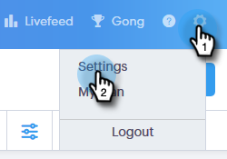
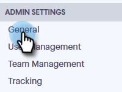
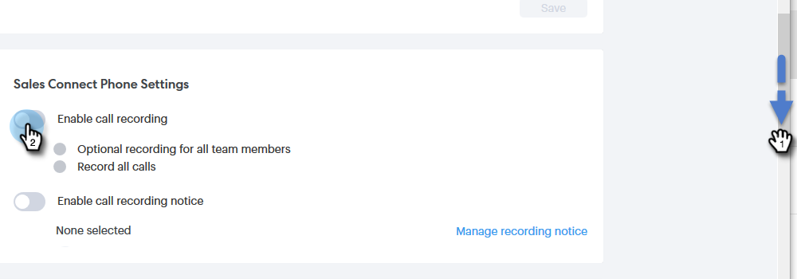
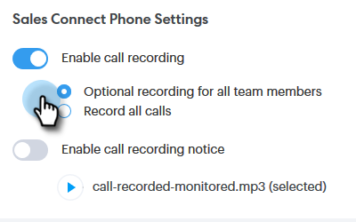

# Enable Call Recording {#enable-call-recording}

As an admin you can enable call recording for your [!DNL Sales Connect] calls. Recording your team's calls can be a great way to coach your sales reps on the best calling practices.

1. Click the Settings icon and select **[!UICONTROL Settings]**.

   

1. Under [!UICONTROL Admin Settings], click **[!UICONTROL General]**.

   

1. Scroll down to [!DNL Sales Connect] Phone Settings and select the **[!UICONTROL Enable call recording]** toggle.

   

1. If you want to give your sellers the ability to enable or disable call recording for themselves, click **[!UICONTROL Optional recording for all team members]**. If you want all calls recorded automatically, click **[!UICONTROL Record all calls]**.

   

>[!MORELIKETHIS]
>
>[Two Party Consent Settings](/help/marketo/product-docs/marketo-sales-connect/phone/two-party-consent-settings.md)
