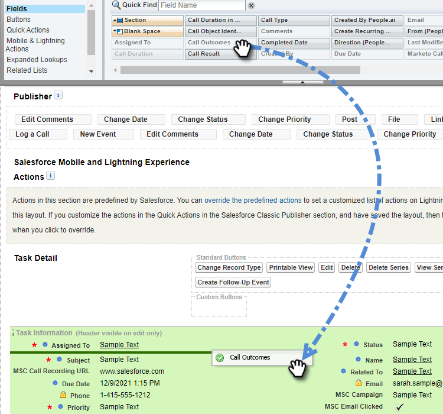
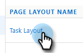

# Log Call Reasons and Call Outcomes to [!DNL Salesforce] {#log-call-reasons-and-call-outcomes-to-salesforce}

If you'd like to log call outcomes and call reasons to [!DNL Salesforce] for reporting or visibility purposes, you can create a custom activity field for each. Each field must use a specific API Name (known as "Field Name" in [!DNL Salesforce]).

* Call Outcomes Field Name: mktosales_call_outcome
* Call Reasons Field Name: mktosales_call_reason

To utilize these fields, you'll first need to create the field as a custom activity field. In order to make it visible to users, you'll need to add it to the task object page layout.

## [!DNL Salesforce] Classic {#salesforce-classic}

### Create Custom Activity Field in [!DNL Salesforce] Classic  {#create-custom-activity-field-in-salesforce-classic}

1. In [!DNL Salesforce], click **[!UICONTROL Setup]**.

   

1. Type "Activities" in the Quick Find box.

   

1. Click **[!UICONTROL Activity Custom Fields]**.

   

1. Click **[!UICONTROL New]**.

   

1. Select the data type “[!UICONTROL Text]” and click **[!UICONTROL Next]**.

   

1. Give the custom field the field name as defined above. Field length has a 255-character limit. Field Label will be the field visible to your sales team and can be customized to meet your team's needs.

   

1. The rest of the settings are optional. Once you’ve completed the configuration, click **[!UICONTROL Next]**.

   

1. Select the desired field-level security settings for this field and click **[!UICONTROL Next]** (the image below is only an example).

   

   >[!NOTE]
   >
   >Make sure the custom field is visible to the profile your [!DNL Sales Connect] users use, along with anyhere else you'd like it visible.

1. Select what page layouts you want the field added to and click **[!UICONTROL Save]** (optionally, you can click **[!UICONTROL Save & New]** and repeat the process for the Call Reason field).

   

### Add Custom Activity Field to Task Page Layout In [!DNL Salesforce] Classic {#add-custom-activity-field-to-task-page-layout-in-salesforce-classic}

>[!NOTE]
>
>You'll only have to follow these steps if you didn't select your desired page layout in Step 9 above.

1. In [!DNL Salesforce], click **[!UICONTROL Setup]**.

   

1. Type "Task" in the Quick Find box.

   

1. Click **[!UICONTROL Task Page Layouts]**.

   

1. Click **[!UICONTROL Edit]** next to the task page layout you'd like to add this field to.

   

1. Drag and drop the field to the desired section of the Task page layout.

   

1. Click **[!UICONTROL Save]**.

   

## [!DNL Salesforce] Lightning {#salesforce-lightning}

### Create Custom Activity Field in [!DNL Salesforce] Lightning {#create-custom-activity-field-in-salesforce-lightning}

1. In [!DNL Salesforce], click on the gear icon on the top right and select **[!UICONTROL Setup]**.

   

1. Click **[!UICONTROL Object Manager]**.

   

1. Type "[!UICONTROL Activity]" in the Quick Find box.

   

1. Click the **[!UICONTROL Activity]** label.

   

1. Click **[!UICONTROL Fields & Relationships]**.

   

1. Click **[!UICONTROL New]**.

   

### Add Custom Activity Field to Task Page Layout In [!DNL Salesforce] Lightning {#add-custom-activity-field-to-task-page-layout-in-salesforce-lightning}

1. In [!DNL Salesforce], click on the gear icon on the top right and select **[!UICONTROL Setup]**.

   

1. Click **[!UICONTROL Object Manager]**.

   

1. Type "[!UICONTROL Task]" in the Quick Find box.

   

1. Click the **[!UICONTROL Task]** label.

   

1. Click **[!UICONTROL Page Layouts]**.

   

1. Click on the task page layout you'd like to add this field to.

   

1. Drag and drop the field to the desired section of the Task page layout.

   

1. Click **[!UICONTROL Save]**.

   

>[!MORELIKETHIS]
>
>[Install Sales Connect Event Fields on Activity History](/help/marketo/product-docs/marketo-sales-connect/crm/salesforce-customization/install-sales-connect-event-fields-on-activity-history.md)
