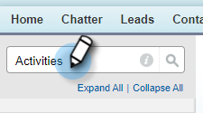
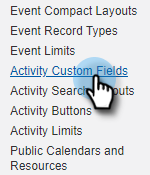
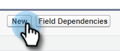
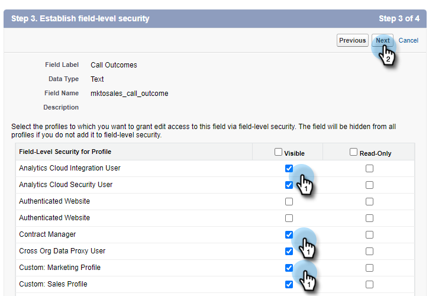

# Log Call Reasons and Call Outcomes to Salesforce {#log-call-reasons-and-call-outcomes-to-salesforce}

If you'd like to log call outcomes and call reasons to Salesforce for reporting or visibility purposes, you can create a custom activity field for each. Each field must use a specific API Name (known as "Field Name" in Salesforce).

* Call Outcomes Field Name: mktosales_call_outcome
* Call Reasons Field Name: mktosales_call_reason

To utilize these fields, you'll first need to create the field as a custom activity field. In order to make it visible to users, you'll need to add it to the task object page layout.

## Salesforce Classic {#salesforce-classic}

### Create Custom Activity Field in Salesforce Classic  {#create-custom-activity-field-in-salesforce-classic}

1. In Salesforce, click **Setup**.

   

1. Type "Activities" in the Quick Find box.

   

1. Click **Activity Custom Fields**.

   

1. Click **New**.

   

1. Select the data type “Text” and click **Next**.

   

1. Give the custom field the field name as defined above. Field length has a 255-character limit. Field Label will be the field visible to your sales team and can be customized to meet your team's needs.

   

1. The rest of the settings are optional. Once you’ve completed the configuration, click **Next**.

   

1. Select the desired field-level security settings for this field and click **Next** (the image below is only an example).

   

   >[!NOTE]
   >
   >Make sure the custom field is visible to the profile your Sales Connect users use, along with anyhere else you'd like it visible.

1. Select what page layouts you want the field added to and click **Save** (optionally, you can click **Save & New** and repeat the process for the Call Reason field).

   

### Add Custom Activity Field to Task Page Layout In Salesforce Classic {#add-custom-activity-field-to-task-page-layout-in-salesforce-classic}

1. In Salesforce, click **Setup**.

   

1. Type "Task" in the Quick Find box.

   

1. Click **Task Page Layouts**.

   

1. Click **Edit** next to the task page layout you'd like to add this field to.

   

1. Drag and drop the field to the Task page layout.

   PICC

1. Click **Save**.

   PICC

## Salesforce Lightning {#salesforce-lightning}

### Create Custom Activity Field in Salesforce Lightning {#create-custom-activity-field-in-salesforce-lightning}

1. In Salesforce, click on the gear icon on the top right.

PICC

1. Click **Setup**.

PICC

1. Click **Object Manager**.

PICC

1. Enter Activity in the Quick Find box and click the Activity label to open the object's setup.

PICC

1. On the left side, click **Fields & Relationships**.

PICC

1. Click **New**.

PICC

## Add Custom Activity Field to Task Page Layout In Salesforce Lightning {#add-custom-activity-field-to-task-page-layout-in-salesforce-lightning}

1. In Salesforce, click on the gear icon on the top right.

PICC

1. Click **Setup**.

PICC

1. Go to Setup.?????????

PICC

1. Type "Task" in the Quick Find box.

PICC

1. Click Task.

PICC

1. Click Page Layouts.

PICC

1. Click pn the task page layout you'd like to add this field to.

PICC

1. Drag and drop the field to the Task page layout.

PICC

1. Click Save.

PICC

>[!MORELIKETHIS]
>
>[Install Sales Connect Event Fields on Activity History](/help/marketo/product-docs/marketo-sales-connect/crm/salesforce-customization/install-sales-connect-event-fields-on-activity-history.md)
