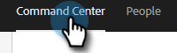
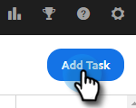
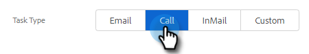
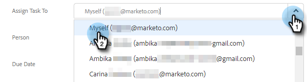
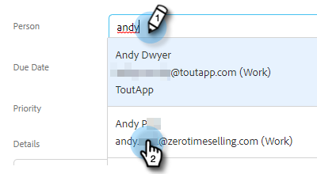
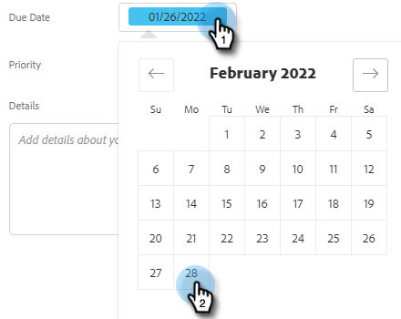
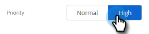
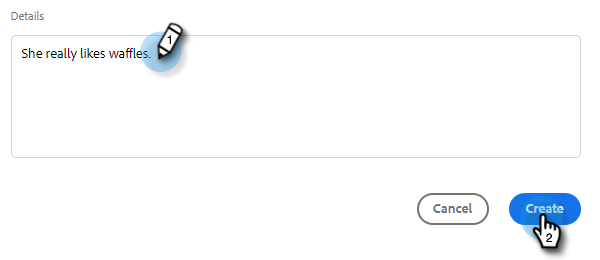

# Create and Assign Reminder Tasks {#create-and-assign-reminder-tasks}

Reminder tasks are a great way to stay on top of your customer and prospect engagement. To create a task, follow these steps.  

1. Click **Command Center**.

   

1. Tasks opens by default. Click **Add Task**.

   

1. Select the task type from Email, Call, InMail, or Custom Task.

   

1. Give the task a name.

   

1. Choose to keep the task assigned to yourself or select another user to assign your task to.

   

1. Add the person you're following up with, with this reminder task.

   

1. Select the date the task is due.

   

1. Select the priority of the task.

   

1. Add any details about the task you'd like available to you when completing the task such as call talking notes, an InMail message template, or even notes about the person. Click **Create** when done.

   
