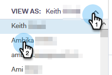
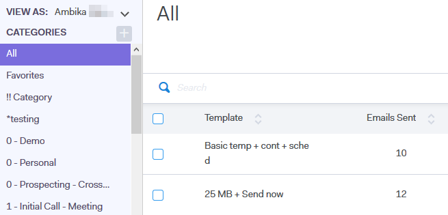

# View Template List as a Another User {#view-template-list-as-a-another-user}

As an Admin, you can view templates as any user.

>[!NOTE]
>
>**Admin Permissions Required**

1. Click **Templates**.

   

1. Click the **View As** drop-down and select the desired user.

   

1. You are now viewing templates as the selected user.

   

   >[!NOTE]
   >
   >You can also use filters or the search function along with View As to view what is most relevant to you.

