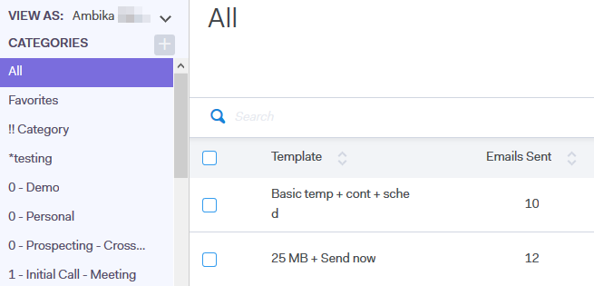

# View Template List as Another User {#view-template-list-as-another-user}

As an Admin, you can view templates as any user.

>[!NOTE]
>
>**Admin Permissions Required**

1. Click **[!UICONTROL Templates]**.

   

1. Click the **[!UICONTROL View As]** drop-down and select the desired user.

   

1. You are now viewing templates as the selected user.

   

   >[!NOTE]
   >
   >You can also use filters or the search function along with [!UICONTROL View As] to view what is most relevant to you.
