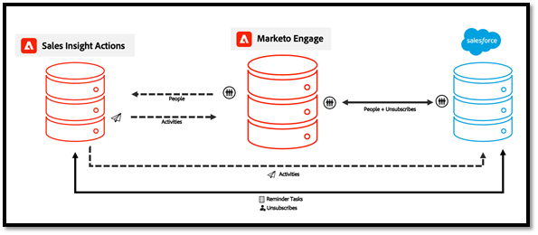
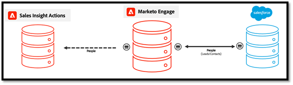
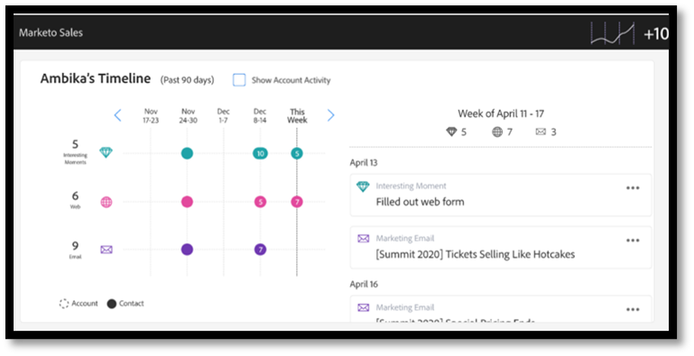
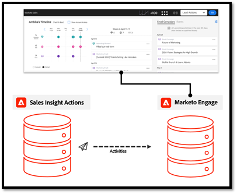
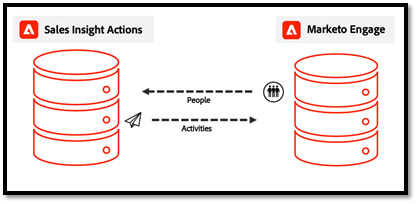
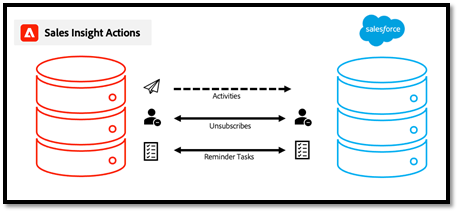

# Actions Data Sync FAQ {#actions-data-sync-faq}

The data unification field sync for Sales Insight Actions enables the system to pull person information from your Marketo Engage database into your Sales Insight Actions database.

This provides up-to-date people data in the Sales Insight Actions web app, and allows the system to collect unique IDs for corresponding person records in Marketo and lead/contact/account/opportunity records in Salesforce, so that records can be properly referenced for logging data.  

This sync can be enabled from the Sales Insight Actions Config tab in the Admin section of Marketo Engage. For more information check out [Initiate Data Sync](/help/marketo/product-docs/marketo-sales-insight/actions/getting-started/msi-actions-admin-guide.md#initiate-data-sync).

   

The diagram above shows how people activity and task data can sync between systems. A few things to note:

* People records are synced to Sales Insight Actions from Marketo Engage, making Marketo Engage the source of truth for Sales Insight Actions people data
* Both Marketo Engage and Sales Insight Actions [have a mechanism](/help/marketo/product-docs/marketo-sales-insight/actions/email/unsubscribes/syncing-unsubscribes-with-salesforce.md) for collecting and syncing unsubscribe status to Salesforce
* Unsubscribe status does not sync from Sales Actions to Marketo Engage, but Sales Insight Actions can be configured to check the Marketo Unsubscribe status of people before allowing sellers to send an email with [Marketo Unsubscribe Check](/help/marketo/product-docs/marketo-sales-insight/actions/email/unsubscribes/marketo-unsubscribe-check.md).

Below are some frequently asked questions related to how the data unification sync works.

## What leads/contacts are synced to Sales Insight Actions? {#what-lead-contacts-are-synced}

   

Leads and contacts who have a sales owner assigned to them will be synced down into Sales Actions.

You can see if a lead/contact has a sales owner in Salesforce by looking at the standard owner field that exists.

The sales owner does not have to be the Marketo sync user or any specific Salesforce or sales user. As long as there's a user listed on the standard owner field we will include the lead/contact to be synced down to Sales Actions, as well as include it in any updates to the synced fields to be made to that lead.

## Where does the activity data displayed in the Sales Insight Smart Grid get sourced from? {#where-does-the-activity-data-get-sourced-from}

   

The activity data such as email, call, interesting moment and web, is all sourced from Marketo Engage’s database. The Sales Insight Smart Grid makes a request to the Marketo Engage instance to retrieve this each time a sales user loads the Sales Insight panel.

   

To ensure all activity data can be sourced from Marketo Engage, Sales Insight Actions syncs all activity data to Marketo Engage.  

## What fields related to people records sync from Marketo Engage to Sales Insight Actions? {#what-fields-sync}

There are 11 fields that sync from Marketo Engage to Sales Insight Actions:

* First name
* Last name
* Salesforce contact ID
* Salesforce lead ID
* Marketo ID
* Company
* Title
* Email
* Phone number
* Linkedin URL
* Source

## Are the fields that sync between Marketo Engage and Sales Insight Actions configurable? {#are-the-fields-that-sync-configurable}

Configuring what Marketo Engage fields sync to Sales Insight Actions is not available, nor is the ability to map fields. The sync from Marketo automatically maps standard Marketo fields to standard fields in your Sales Action instance.

## Why does Sales Insight Actions have its own database? {#why-does-actions-have-its-own-database}

Sales Insight Actions has its own web application with a dedicated person and activity database to provide an optimized workspace that is built and designed for sales teams. This enables sales managers and sellers to have a space to build out and manage their engagement strategy   without granting access or privileges to the primary Marketo Engage workspace, which is optimized for marketing operation specialists.

## How are duplicates handled? {#how-are-duplicates-handled}

Your Sales Actions database will be a copy of those qualified people (leads/contacts with a sales owner) that exist in your Marketo Engage database. This means if there are two records with the same email address created in Marketo, there will be a duplicate record created in Sales Actions.

## How long does it take for the initial sync to complete? {#how-long-initial-sync}

The initial process for syncing all of your sales lead data into a new Sales Insight Actions instance will typically process people at about 1,000 every 1-2 minutes. This is just an estimate and can vary.

Once the initial sync takes place and all your sales leads have been populated into your Sales Insight Actions web app instance, there will be an incremental sync that will run every time there's an update to one of the supported fields that are synced.

## Can Sales Insight Actions users edit people data from the Actions web app? {#can-actions-users-edit-people-data}

No, the ability to create and edit people records in Actions is not available for both users and admins of the Actions web app. Creating and editing people must be done in either Salesforce or Marketo Engage. Sales Insight Actions uses Marketo as its source of truth for people data by continuously syncing new data, so if a person is updated or created in Marketo either from a workflow in Marketo or synced over from Salesforce, those updates will be passed to the Sales Insight Actions web app database.

## Do sales activities log to Marketo? {#do-sales-activities-log-to-marketo}

Yes, sales engagement activities will log to Marketo as native activities. These activites also include native filters that can be used with constraints to target leads based on sales activity attributes.

   

Below is a list of the activities that log to Marketo:

* Send Sales Email
* Open Sales Email
* Click Sales Email
* Replied to Sales Email
* Sales Email Bounced
* Sales Call Received
* Add to Sales Campaign
* Removed from Sales Campaign

## Do sales activities log to Salesforce? {#do-sales-activities-log-to-salesforce}

Yes, sales engagement activities will log to Salesforce as native tasks. These tasks can then be used in Salesforce reports to power team dashboards that track sales activities.

Sales Insight Actions allows admins to configure what sales activities are logged to Salesforce. These activities include emails, calls, and open reminder tasks.

   

The diagram above shows what information is logged to Salesforce. Activities such as emails and calls are logged to Salesforce in a [one-way sync](/help/marketo/product-docs/marketo-sales-insight/actions/crm/salesforce-integration/salesforce-sync-settings.md). [Unsubscribes](/help/marketo/product-docs/marketo-sales-insight/actions/email/unsubscribes/syncing-unsubscribes-with-salesforce.md) and [Reminder Tasks](/help/marketo/product-docs/marketo-sales-insight/actions/tasks/reminder-task-sync-with-salesforce.md) are kept up to date with a two-way sync. Each of these data syncs is configurable from Sales Insight Actions web app interface.

>[!MORELIKETHIS]
>
>* [Syncing Unsubscribes with Salesforce](/help/marketo/product-docs/marketo-sales-insight/actions/email/unsubscribes/syncing-unsubscribes-with-salesforce.md)
>* [Marketo Unsubscribe Check](/help/marketo/product-docs/marketo-sales-insight/actions/email/unsubscribes/marketo-unsubscribe-check.md)
>* [Salesforce Sync Settings](/help/marketo/product-docs/marketo-sales-insight/actions/crm/salesforce-integration/salesforce-sync-settings.md)
>* [Reminder Task Sync with Salesforce](/help/marketo/product-docs/marketo-sales-insight/actions/tasks/reminder-task-sync-with-salesforce.md)
