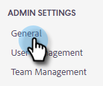
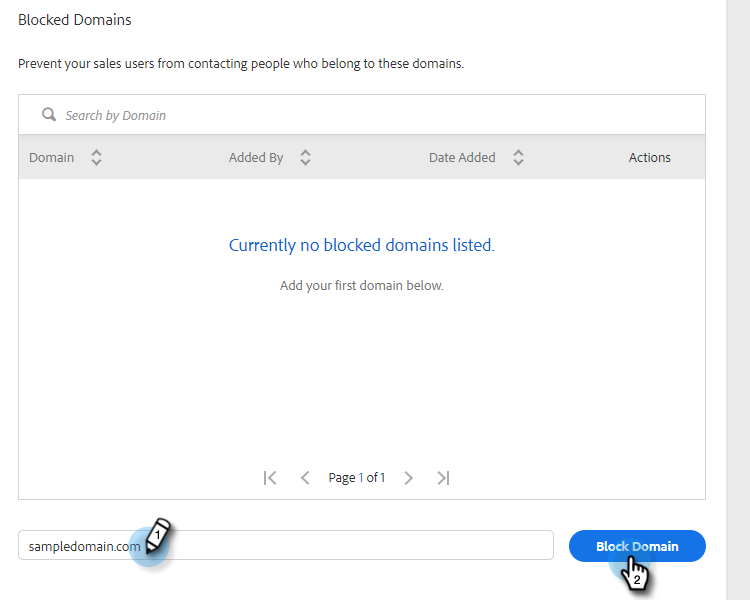

# Blocked Domains {#blocked-domains}

Help your sales team achieve success by preventing them from accidentally emailing competitors, known spam traps, or any other domain you don't want contacted.

>[!NOTE]
>
>**Admin Permissions Required**

1. In the web application, click the gear icon and select **Settings**.

   

1. Under Admin Settings, click **General**.

   

1. Enter the domain you want blocked and click **Block Domain**.

   

   >[!NOTE]
   >
   >Emails that are part of a Group Email send that fails due to being sent to a blocked email domain will fail silently and not appear in the failed email folder.
