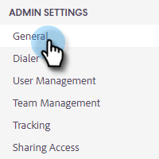
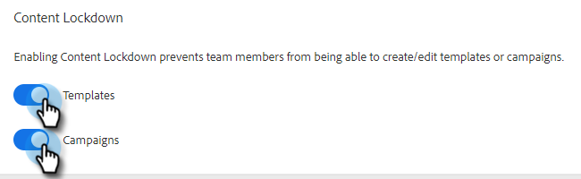

# Content Lockdown {#content-lockdown}

By enabling content lockdown, restrict non-Admin users from editing templates and/or campaigns. Users will not be able to: share, clone, edit, or delete content. They also won’t have the option to archive templates.

>[!NOTE]
>
>Users will still be able to edit the content of an email at the time of sending, or when launching a campaign.

1. Click the gear icon and select **Settings**.

   

1. Under Admin Settings, click **General**.

   

1. Scroll down to Content Lockdown. Turning either slider on will disable your team members’ ability to create/edit templates and/or campaigns.

   
