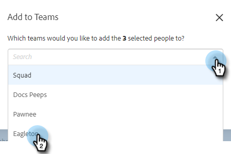

# Create a Team {#create-a-team}

Creating a team allows you to assemble a group of users that content can be shared with and reports can be filtered by.

## Create a Team {#create-a-team}

1. In the [web application](https://toutapp.com/login), click the gear icon and select **Settings**.

   

1. Under Admin Settings, select **Team Management**.

   

1. Next to Teams, click the **+** icon.

   

1. Enter a team name and click **Create**.

   

>[!NOTE]
>
>You can now share templates, campaigns and groups with that team.

## Add People to a Team {#add-people-to-a-team}

1. Still in Team Management, select **All Members**.

   

1. Locate the users you want added to your team and select their checkbox.

   

1. Click **Add to Teams**.

   

1. Click the drop-down and select your desired team(s).

   

1. Click **Add** when done.

   
