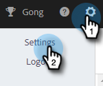
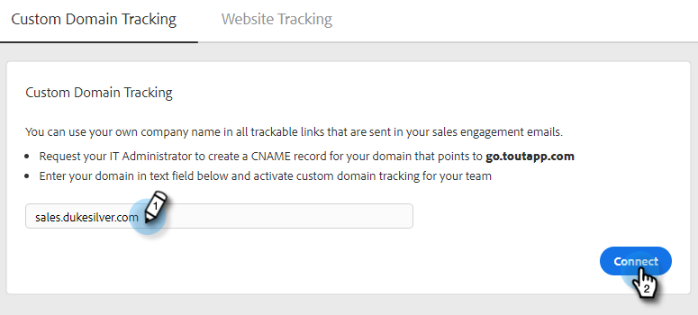

# How to Set up Custom Domain Tracking {#how-to-set-up-custom-domain-tracking}

Custom Domain Tracking allows your team to use your own company name in all trackable links that are added to your sales emails. Once you have this set up, we will allowlist any link you have in your email to appear as go.yourcompany.com, so that when someone hovers over a link, it will read go.yourcompany.com instead of go.toutapp.com.

You'll need assistance from your IT team to set up a CNAME record for your domain that points to go.toutapp.com. This CNAME will be what appears on all of your tracking links (e.g., go.yourcompany.com).

Once you've confirmed with your IT team that the CNAME is properly configured, you can add it to the Custom Domain Tracking page in Actions.  

>[!NOTE]
>
>If your CNAME is not set up properly and you activate it as your custom domain in Actions, it can break tracking links and pixels.

## Enable Custom Domain Tracking {#enable-custom-domain-tracking}

>[!NOTE]
>
>**Admin privileges required.**

1. Click the gear icon and select **Settings**.

   

1. Under Admin Settings, select **Tracking**.

   

1. In the Custom Domain Tracking tab, enter your CNAME and click **Connect**.

   
