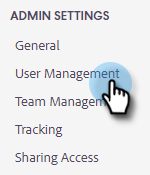

# Invite Users and Admins {#invite-users-and-admins}

Adding users or Admins is quick and easy!

## Invite Users {#invite-users}

1. Click the gear icon and select **Settings**.

   

1. Under Admin Settings, select **User Management**.

   

1. Click the **Actions** button and select **Invite Users**.

   

   >[!NOTE]
   >
   >You can also select **Invite Users via CSV** if you have them all listed in a spreadsheet.

1. Enter the email addresses of the individuals you'd like to add.

   

1. OPTIONAL STEP: Add the user(s) to any team(s) they should be a part of. If you skip this part, all new members will be added to the Everyone team.

   

   >[!NOTE]
   >
   >[Learn more about Teams](/help/marketo/product-docs/marketo-sales-insight/actions/admin/creating-a-team.md).

1. Select the Marketo workspace you want to add the new user(s) to. If you only have one workspace, you'll see "Default" as your option. Click **Invite**.

   

1. Click **OK**.

   

## Make a User an Admin {#make-a-user-an-admin}

>[!NOTE]
>
>**Admin permissions required**

Follow these steps to make an existing user an Admin.

1. Click the gear icon and select **Settings**.

   

1. Under Admin Settings, select **User Management**.

   

1. Find the user you'd like to make an Admin, click the Role drop-down, and select **Admin**.

   

Simple as that!
