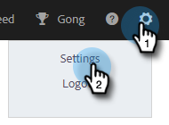
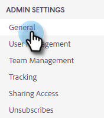
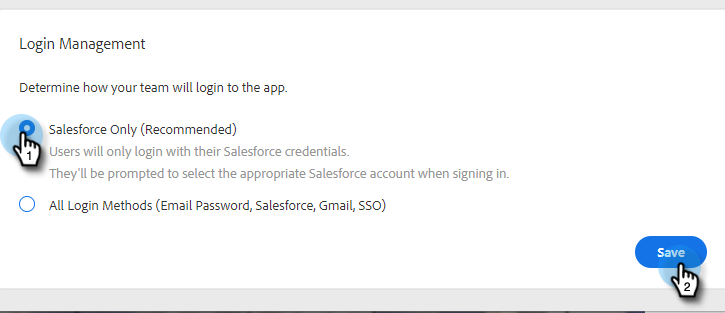
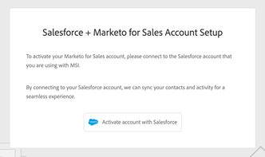
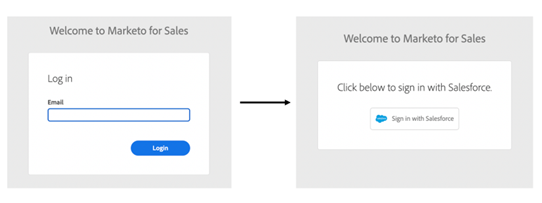
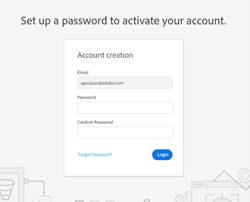

# Login Management Settings {#login-management-settings}

Login Management settings allow admins to set the authentication preferences for users of Sales Insight Actions on a global level.

>[!NOTE]
>
>By default, the Salesforce Only option will be selected for Sales Insight Actions instances. We recommend this setting so that users can [auto-login](/help/marketo/product-docs/marketo-sales-insight/actions/admin/auto-login-from-salesforce.md) from Salesforce.

## Update Login Management Settings {#update-login-management-settings}

>[!NOTE]
>
>**Admin permissions required**

The update your login management preferences, follow these steps.

1. Click the gear icon and select **Settings**.

   

1. Under Admin Settings, click **General**.

   

1. Scroll down to Login Management card and select the desired setting (in this example we're choosing Salesforce Only). Click **Save** when done.

   

## Salesforce Only FAQ {#salesforce-only-faq}

Salesforce Only means that users can only authenticate to use Sales Insight Actions with Salesforce. It's the default selection for Sales Insight Actions instances, and is recommended because of its ability to allow users to authenticate seamlessly without having to manage a username and password.

### How does a new user to my instance activate their account when “Salesforce Only” is selected? {#activate-when-salesforce-only-is-selected}

Upon clicking the **Getting Started** button in the invitation email, new users will be sent to an account activation screen where they'll be required to connect their Salesforce instance to activate their Sales Insight Actions account.

   

### What authentication methods are my users allowed to authenticate with when “Salesforce Only” is selected? {#what-authentication-methods}

When navigating to our login screen, users will first input their email address. Then they'll click the Salesforce One Click Login button, where they can authenticate using the Salesforce account they're logged in to.  

>[!NOTE]
>
>This only pertains to users who navigate directly to the login screen. Users who are accessing Actions from Salesforce will be logged in with [Auto-login](/help/marketo/product-docs/marketo-sales-insight/actions/admin/auto-login-from-salesforce.md).

   

### How is user authentication handled for Actions when a user accesses an Actions feature from Salesforce and “Salesforce Only” is selected? {#how-is-user-authentication-handled}

When a user clicks on one of the actions (Call, Email, Campaign, Tasks, Campaign List etc…) we use their SFDC authentication to automatically log them into their Sales Insight Actions account. We call this authentication [Auto-login](/help/marketo/product-docs/marketo-sales-insight/actions/admin/auto-login-from-salesforce.md).

## All Login Methods FAQ {#all-login-methods-faq}

### How does a new user to my instance activate their account when “All Login Methods” is selected? {#activate-when-all-login-methods-is-selected}

When a new user is invited to an instance, they will receive an account activation email. They will click on the button that says “Get Started” which will then take them to a page that asks them to create and confirm a password. Once this is created their account will be activated and they will be taken through the onboarding workflow.

   

### What are users of my instance allowed to log in with when “All Login Methods” is selected? {#what-are-users-allowed-to-log-in-with-all-login}

When using our login page, users will first input their email address. Then they'll be sent to a page that gives them all login options (username/password, SFDC, Gmail, SSO) to authenticate with.
