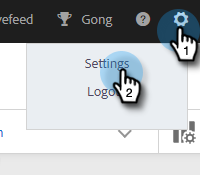
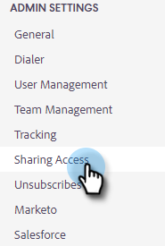
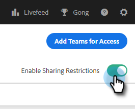
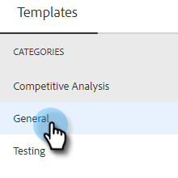
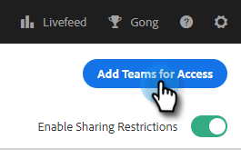
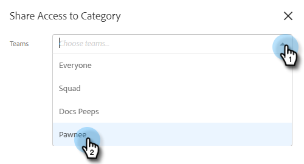
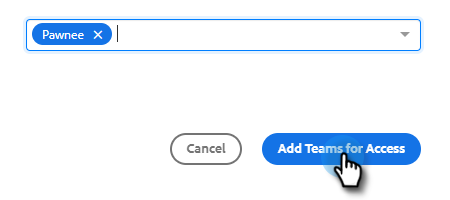
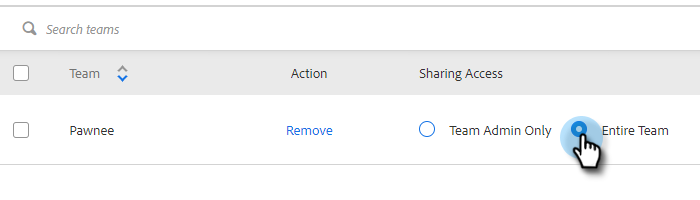

# Sharing Settings {#sharing-settings}

Better manage your templates by restricting what users can share and with which categories.

When your Sales Insight Actions account is first created, Sharing Settings is enabled. This gives your account admins the opportunity to create and organize your template categories before opening the floodgates and allowing users to share content into your team categories.

When Sharing Settings is enabled, only admins will be able to share into categories unless sharing privileges are provided to a team or everyone. With Sharing Settings disabled, there are no restrictions and all users can share into any template categories.

## Configure Your Sharing Settings {#configure-your-sharing-settings}

1. In the [web application](https://toutapp.com/login), click the gear icon and select **Settings**.

   

1. Under Admin Settings, select **Sharing Access**.

   

1. Make sure **Sharing Settings** is enabled. This means by default, only Admins will be able to share templates in your template categories.

   

1. Select the template category you want to configure.

   

1. Click **Add Teams for Access**.

   

1. Select the teams you want to add.

   

   >[!NOTE]
   >
   >If you don't see any teams, you'll need to go to Team Management and create a team of users.

1. Click **Add Teams for Access** to save.

   

1. Now that your team has been added you can select to allow only team admins to share or all users on that team. In this example we're giving all users on the SDR team sharing access.

   
