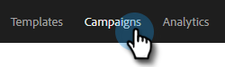
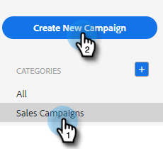
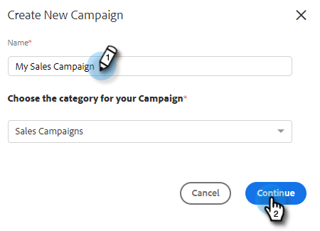
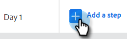
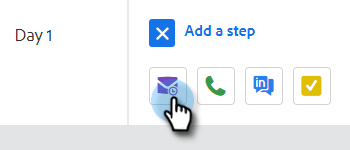
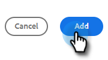
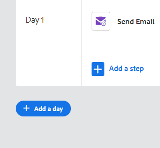
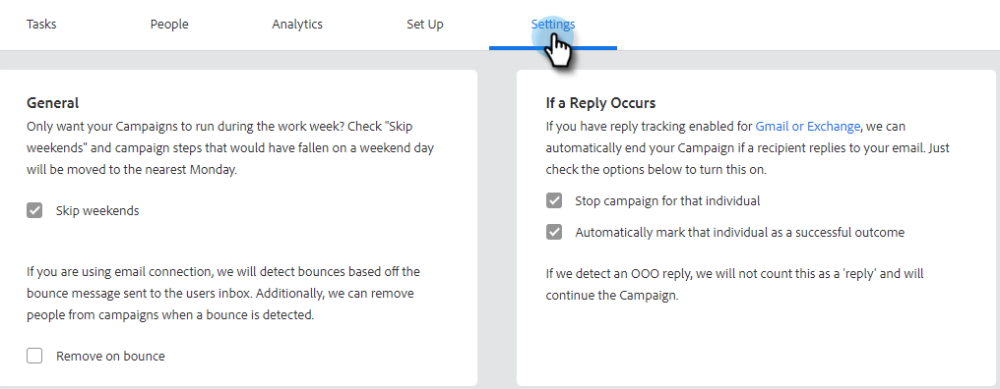

# Create a Sales Campaign {#create-a-sales-campaign}

Sales Campaigns are a series of multi-channel steps including: emails, phone calls, InMail, and custom tasks. They allow you to streamline your communications with your potential and existing customers.

With Sales Campaigns you can:

* **Organize**: Streamline all your outreach activities in one place for efficient execution.
* **Scale**: Schedule all your outreach efforts so you can scale your efforts, minimize manual work, and personalize as much as you need.
* **Measure**: Track the success of all your emails and tasks in one place while automatically logging them into [!DNL Salesforce]. By knowing what is resonating and leading to results, you can consistently test and improve your results.

So, how do you set up a Sales Campaign?

1. Click the **[!UICONTROL Campaigns]** tab.

   

1. Select a category and click the **[!UICONTROL Create New Campaign]** button.

   

   >[!NOTE]
   >
   >Create a new category by clicking the **+** next to **[!UICONTROL Categories]**.

1. The category you chose will be selected. If you change your mind, click the drop-down and select a different one. When you're done, click **[!UICONTROL Continue]**.

   

1. Click **[!UICONTROL Add a Step]**.

   

1. Choose between: Email, Call, InMail, or Custom Task. In this example we're choosing Email.

   

1. When you're [done with your email](/help/marketo/product-docs/marketo-sales-insight/actions/campaigns/sales-campaign-step-types-and-reminder-tasks.md#email){target="_blank"}, click **[!UICONTROL Add]**.

   

1. After you create your first day and step, the "[!UICONTROL Add a Day]" button activates and you can add as many days and steps as your sales process requires.

   

   >[!NOTE]
   >
   >"Days" are not the number of days between actions, but the day within the sequence. For example, if your Sales Campaign is going to last 7 days, entering '3' means the action will go out on day 3 of 7, **not** 3 days later.

1. Make sure you customize scheduling and reply options, such as skipping weekends (which is awesome) by visiting the **[!UICONTROL Settings] Tab** for your Sales Campaign.

   

Now it's time to start adding people!

>[!MORELIKETHIS]
>
>* [Sales Campaign Send Options for Email Steps](/help/marketo/product-docs/marketo-sales-insight/actions/campaigns/sales-campaign-send-options-for-email-steps.md){target="_blank"}
>* [Sales Campaign Step Types and Reminder Tasks](/help/marketo/product-docs/marketo-sales-insight/actions/campaigns/sales-campaign-step-types-and-reminder-tasks.md){target="_blank"}
>* [Sales Campaign Settings](/help/marketo/product-docs/marketo-sales-insight/actions/campaigns/sales-campaign-settings.md){target="_blank"}
