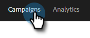
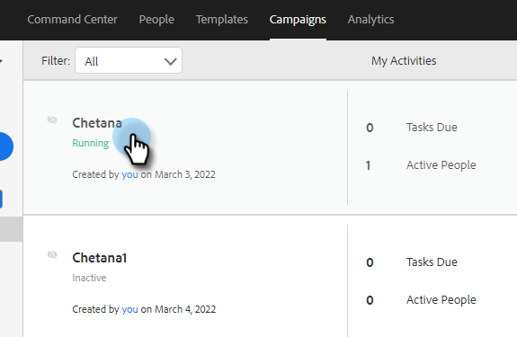
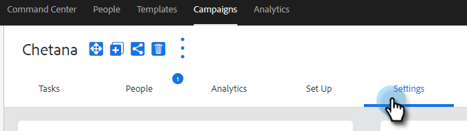
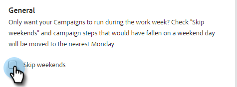
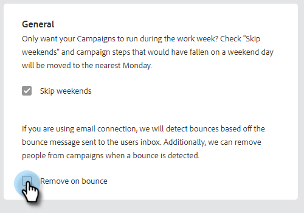

# Sales Campaign Settings {#sales-campaign-settings}

The Sales Campaign settings section allows you to configure a specific Sales Campaign so it can work to best fit your team's use cases for that Sales Campaign.

## Skip Weekends {#skip-weekends}

Enable skip weekends so any steps that would have fallen on a weekend day (Saturday or Sunday) will be moved to Monday.

>[!NOTE]
>
>With Skip Weekends enabled, emails will be scheduled based on a 5-day week. Meaning, when a step is scheduled, weekends will be ignored as days.

1. Click **Campaigns**.

   

1. Choose your desired Sales Campaign.

   

1. Click the **Settings** tab.

   

1. Select the **Skip Weekends** checkbox.

   

## Remove on Bounce {#remove-on-bounce}

If you're using email connection, we will detect bounces based off the bounce message sent to the users inbox. Additionally, we can remove people from Sales Campaigns when a bounce is detected.

1. Click **Campaigns**.

   

1. Choose your desired Sales Campaign.

   

1. Click the **Settings** tab.

   

1. Select the **Remove on Bounce** checkbox.

   

## If a Reply Occurs {#if-a-reply-occurs}

If you have reply tracking enabled for Gmail or Exchange, we can automatically end your Sales Campaign if a recipient replies to your email.

1. Click **Campaigns**.

   

1. Choose your desired Sales Campaign.

   

1. Click the **Settings** tab.

   

1. Under **If a Reply Occurs**, make your desired selection(s).

   

>[!MORELIKETHIS]
>
>* [Create a Sales Campaign](/help/marketo/product-docs/marketo-sales-insight/actions/campaigns/create-a-sales-campaign.md){target="_blank"}
>* [Understanding Sales Campaign Send Options for Email Steps](/help/marketo/product-docs/marketo-sales-insight/actions/campaigns/understanding-sales-campaign-send-options-for-email-steps.md){target="_blank"}
>* [Sales Campaign Step Types and Reminder Tasks](/help/marketo/product-docs/marketo-sales-insight/actions/campaigns/sales-campaign-step-types-and-reminder-tasks.md){target="_blank"}
