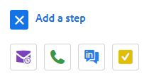
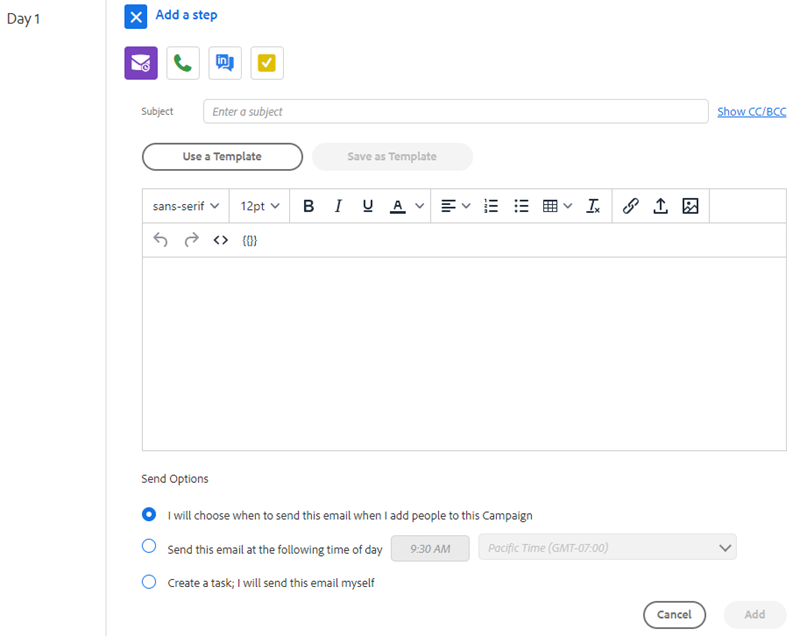
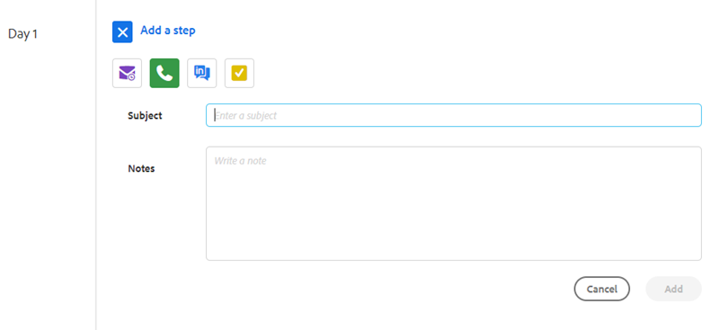
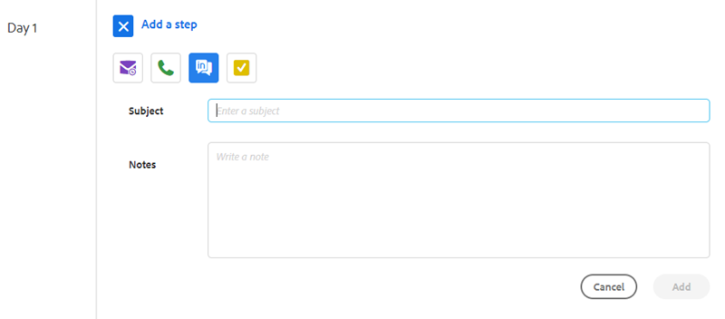
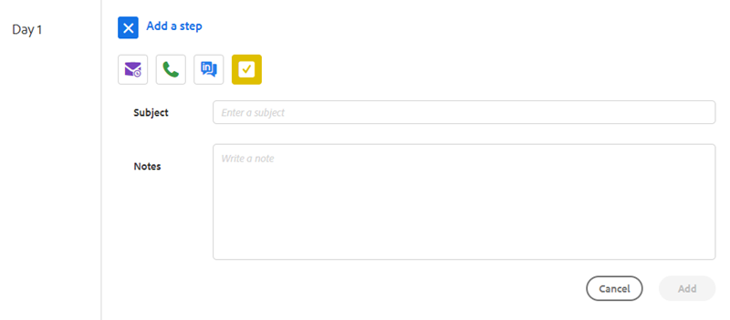

# Sales Campaign Step Types and Reminder Tasks {#sales-campaign-step-types-and-reminder-tasks}

## Sales Campaign Step Types {#sales-campaign-step-types}

When adding a step to your Sales Campaign, you have four options.

### Email {#email}

Compose a new email, or use a pre-existing template.

| **Use a Template** |Select one of your pre-existing templates |
|---|---|
| **Save as Template** |Save the email you just composed as a new template |
| **Add Content** |Upload a file to our server and receive a URL (pointing to the content) that can be tracked in your email |
| **Attach Files** |Attach a file from your computer to the email (23MB size limit) |

>[!TIP]
>
>Learn the details about your [sending options](/help/marketo/product-docs/marketo-sales-insight/actions/campaigns/understanding-sales-campaign-send-options-for-email-steps.md){target="_blank"}.

### Call {#call}

Set a reminder to follow-up with a contact via phone. You can also save notes to be used as a talk track during the call.

### InMail {#inmail}

Following up on multiple channels is a great way to connect with leads. With InMail tasks, you can set up a reminder to reach out via LinkedIn.

### Custom Task {#custom-task}

Utilize custom tasks when the above options are not applicable. For example, you can invite a colleague to follow up with a lead via email.

## Using Reminder Tasks in Sales Campaigns {#using-reminder-tasks-in-sales-campaigns}

Tasks are a powerful tool when sending a Sales Campaign to a contact, especially if your sales process is multi-channel/touch.
  
Task to send an Email and Task to Call a contact are the most common uses for Tasks in Sales Campaigns.
  
You can also make a "Task to Inmail" a contact on LinkedIn if that's part of your workflow. You can also make a custom task to remind you to invite them to a happy hour, ask about their charity event, or check-in after game 5, etc.

>[!NOTE]
>
>The most important thing about Tasks in Sales Campaigns, you have to complete the task in order to trigger the next step.

>[!MORELIKETHIS]
>
>[Create a Sales Campaign](/help/marketo/product-docs/marketo-sales-insight/actions/campaigns/create-a-sales-campaign.md){target="_blank"}
