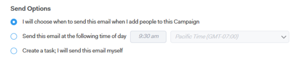

# Understanding Sales Campaign Send Options for Email Steps {#understanding-sales-campaign-send-options-for-email-steps}

When you are creating a Campaign, you have several options on how your email steps get created in Sales Insight Actions. And, depending on where your email falls in your Campaign, your options also differ.
  
If it's your first step and the first day in your Campaign, you will have the following options:

I will choose when to send this email

* This option allows you to choose the "send at" time for the first email in your Campaign when you kick off the Campaign by adding people.

Send this email at the following time

* When you kick off your Campaign by adding people to it, we will schedule the email for this time.
* You always have the option to choose a new "send at" time when you are kicking off your Campaign.

Create a task; I will send this email myself

* This option will create an Email Task (and sync to Salesforce) that you can send at your convenience.
* Once you've made this selection, when you kick off your Campaign, we will queue these tasks up for you in Command Center and the Live Feed. You can then personalize and send (or schedule) each email before it goes out.

  * If you open this task in our web application, it will open a compose window with your contact's email address, the subject line of your email, and the template you chose.
  * If you open this task in Gmail or Outlook, it will open a native compose window and dynamically populate your contact's email address, the subject line of your email, and the template you chose.

For any subsequent days/steps in your Campaign, you will have the following options:

Send this email at the same time as the previous email in this Campaign

* This option will send the email at the same time as the email directly before it.
* It will still send on the day it is associated with.

Send this email at the following time

* When you kick off your Campaign by adding people to it, we will schedule the email for this time.
* You always have the option to choose a new "send at" time when you are kicking off your Campaign.

Create a task; I will send this email myself

* This option will create an Email Task (and sync to Salesforce) that you can send at your convenience.
* Once you've made this selection, when you kick off your Campaign, Tout will queue these tasks up for you in Command Center and the Live Feed. You can then personalize and send (or schedule) each email before it goes out.

  * If you open this task in our web application, it will open a compose window with your contact's email address, the subject line of your email, and the template you chose.
  * If you open this task in Gmail or Outlook, it will open a native compose window and dynamically populate your contact's email address, the subject line of your email, and the template you chose.

Thread this email to the previous email

* This send option will be a 'follow up' to your previous email and will append the previous email body to the bottom of this email.

>[!MORELIKETHIS]
>
>[Create a Sales Campaign](/help/marketo/product-docs/marketo-sales-insight/actions/campaigns/create-a-sales-campaign.md){target="_blank"}
>[Sales Campaign Step Types and Reminder Tasks](/help/marketo/product-docs/marketo-sales-insight/actions/campaigns/sales-campaign-step-types-and-reminder-tasks.md){target="_blank"}
>[Sales Campaign Settings](/help/marketo/product-docs/marketo-sales-insight/actions/campaigns/sales-campaign-settings.md){target="_blank"}
