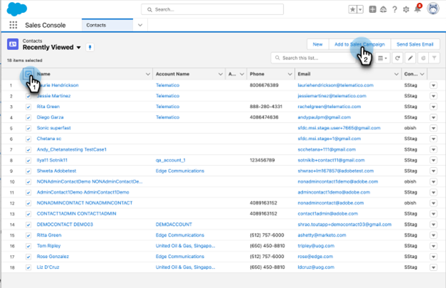
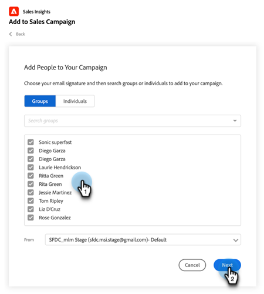
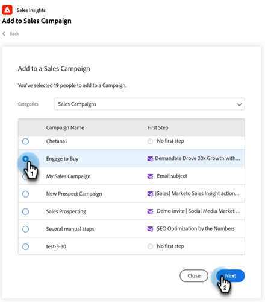
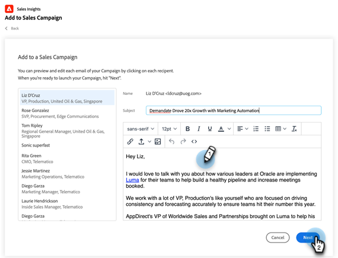
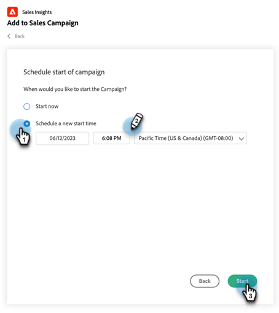
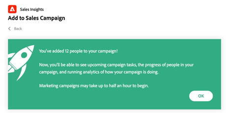
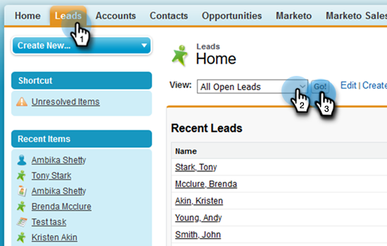
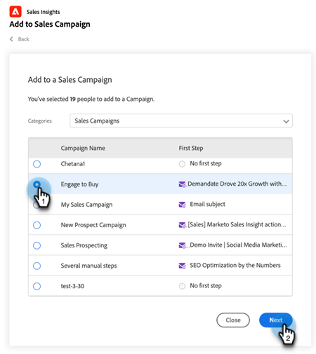
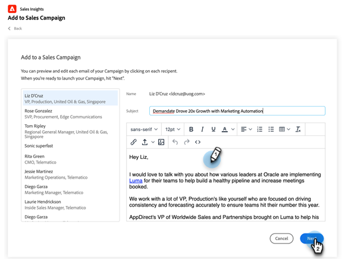
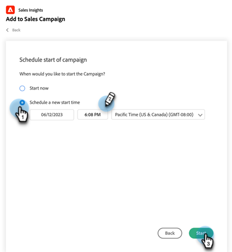

# Using Bulk Add to Sales Campaign in Salesforce {#using-bulk-add-to-sales-campaign-in-salesforce}

Learn how to bulk add to Sales Campaign in Salesforce to help scale your outbound communication using Sales Actions. 

>[!NOTE]
>
>Salesforce enforces a limit of 200 records that can be selected at once.

>[!PREREQUISITES]
>
>Make sure you've installed the [latest Sales Insight package](/help/marketo/product-docs/marketo-sales-insight/msi-for-salesforce/upgrading/upgrading-your-msi-package.md){target="_blank"} to your Salesforce instance and have configured the [Action buttons](/help/marketo/product-docs/marketo-sales-insight/actions/crm/salesforce-package-configuration/add-action-buttons-to-salesforce-list-view.md){target="_blank"} on your contact and lead list views in Salesforce.

## Bulk Add to Sales Campaign in Salesforce Lightning {#bulk-add-to-sales-campaign-in-salesforce-lightning}

1. In Salesforce, navigate to the Leads/Contacts home page by clicking on the **Leads/Contacts** tab.

   

1. In the **View** drop-down, select the desired view of Leads/Contacts you want to email. 

   >[!TIP]
   >
   >You can create a new view by clicking the cog icon on the right and selecting **New**. Once you've given the view a new name and saved it, you can click the filter icon on the right to help filter down to the desired set of Leads/Contacts you want to email.

1. Choose the desired leads or contacts list and click the **Add to Sales Campaign** button.

   
 
1. You will be navigated to the Actions Sales Campaign modal, with the recipients you've selected added.

1. Make any edits needed to remove people or groups, then click **Next**.

   

1. Select the Sales Campaign Category you want to use from the Categories drop-down.

1. Select the Sales Campaign you want to add the selected people to and click **Next**.

   
 
1. You may see different options depending on what the first step in your campaign is. If your first step is an email, you'll have the option to edit the email for each recipient as seen below. Once this is done, click **Next**.

   

1. Again, if your first step is an email and you configured it to allow you to select when the campaign launches, you'll have the option to **Start Now** or **Schedule a New Start Time**. Once this has been completed, click **Start**.

   
 
After clicking Start, you'll see a confirmation screen letting you know how many people have been added.

   
 
## Bulk Add to Sales Campaign in Salesforce Classic {#bulk-add-to-sales-campaign-in-salesforce-classic}

1. In Salesforce, click the **Leads/Contacts** tab.

1. In the View drop-down, select the desired view of Leads/Contacts you want to email and click **Go**.

   

   >[!TIP]
   >
   >You can create a new view by clicking Create New View and configuring the available filters to narrow down the list of recipients you will email.

1. Choose the desired lead or contact list and click the **Add to Sales Campaign** button.
 
1. You will be navigated to the Actions Sales Campaign modal with the people you selected added.

1. Make any edits needed to remove people or groups, then click **Next**.

   

1. Select the Sales Campaign Category you want to use from the **Categories** drop-down.

1. Select the Sales Campaign you want to add the selected people to and click **Next**.

   

1. You may see different options depending on what the first step in your campaign is. If your first step is an email, you'll have the option to edit the email for each recipient as seen below. Once this is done, click **Next**.

   

1. Again, if your first step is an email and you configured it to allow you to select when the campaign launches, you'll have the option to **Start Now** or **Schedule a New Start Time**. Once this has been completed, click **Start**.

   
 
After clicking Start, you'll see a confirmation screen letting you know how many people have been added.

   
