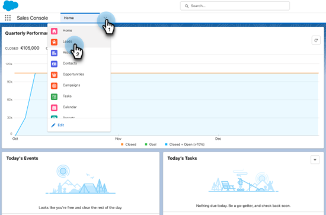
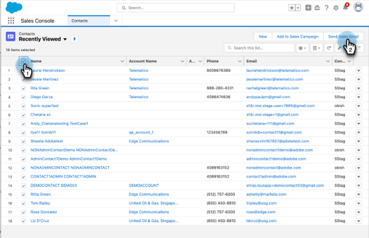
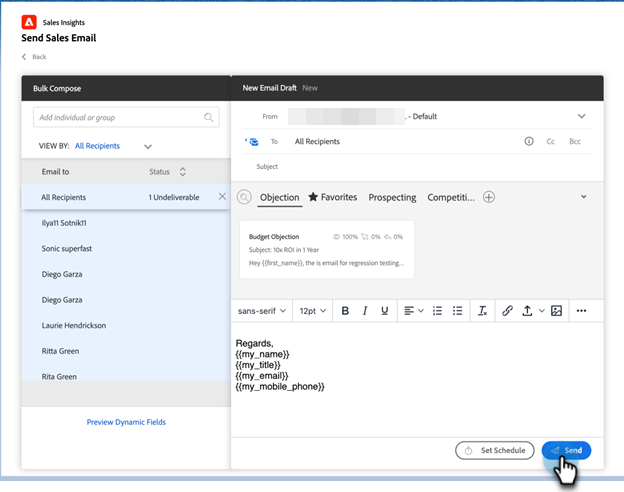
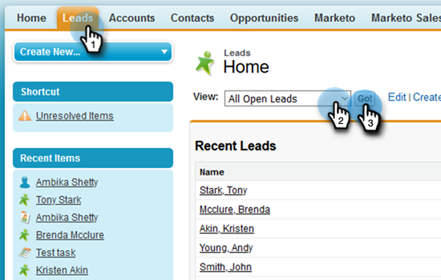
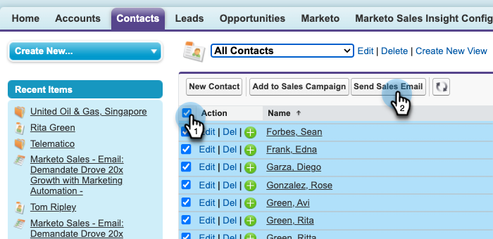
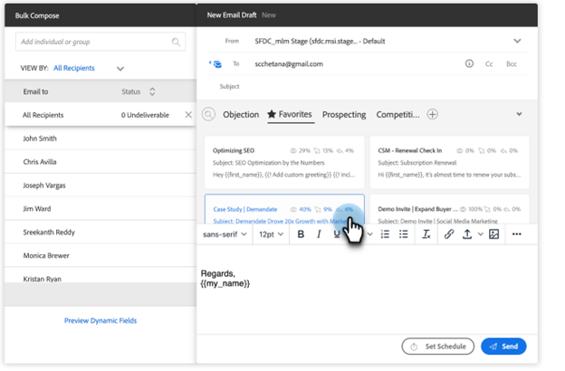

# Using Bulk Send Sales Email in Salesforce {#using-bulk-send-sales-email-in-salesforce}

Learn how to send bulk emails in Salesforce to help scale your outbound communication using Sales Actions. 

>[!NOTE]
>
>Salesforce enforces a limit of 200 records that can be selected at once.

>[!PREREQUISITES]
>
>Make sure you've installed the [latest Sales Insight package](/help/marketo/product-docs/marketo-sales-insight/msi-for-salesforce/upgrading/upgrading-your-msi-package.md){target="_blank"} to your Salesforce instance and have configured the [Action buttons](/help/marketo/product-docs/marketo-sales-insight/actions/crm/salesforce-package-configuration/add-action-buttons-to-salesforce-list-view.md){target="_blank"} on your contact and lead list views in Salesforce.

## Sending Bulk Email in Salesforce Lightning {#sending-bulk-email-in-salesforce-lightning}

1. In Salesforce, navigate to the Leads/Contacts home page by clicking the **Leads/Contacts** tab.

   

1. In the View drop-down, select the desired view of Leads/Contacts you want to email. 

   >[!TIP]
   >
   >You can create a new view by clicking the cog icon on the right and selecting **New**. Once you've given the view a new name and saved it, you can click the filter icon on the right to help filter down to the desired set of Leads/Contacts you want to email.

1. Choose the desired lead or contact list and click the **Send Sales Email** button.

   
 
1. You'll be navigated to the Actions compose window, with the people you selected added.

1. Select the template you want to insert into the Actions compose window editor or write a custom email.

   >[!TIP]
   >
   >Use [Pinned Categories](/help/marketo/product-docs/marketo-sales-insight/actions/email/using-the-compose-window/using-a-template-in-the-compose-window.md#pinning-template-categories-in-the-compose-window){target="_blank"} to provide easier access to your favorite email templates.

   **OPTIONAL STEP**: Preview any Dynamic Fields personalization by clicking the **Preview Dynamic Fields** button.

   >[!TIP]
   >
   >If you want to customize a template for all recipients, clicking the All-Recipients option in the Bulk Compose sidebar allows you to make edits to all recipient emails at the same time. If you want to make a change to a specific email, click on the recipient's name or email in the Bulk Compose sidebar. Please note, if you make changes to an individual email then make changes while selecting All Recipients, the changes made to All Recipients will overwrite the changes made to the individual email.

1. Select **Send** to send the email immediately, or **Set Schedule** to set a date and time for the email to be sent.

   
 
## Sending Bulk Email in Salesforce Classic {#sending-bulk-email-in-salesforce-classic}

1. In Salesforce, click the **Leads/Contacts** tab.

1. In the View drop-down, select the desired view of Leads/Contacts you want to email and click **Go**.

   

   >[!TIP]
   >
   >You can create a new view by clicking Create New View and configuring the available filters to narrow down the list of who you're adding to a Sales Campaign.

1. Choose the desired leads or contacts list and click the **Send Sales Email** button.

   
 
1. You'll be navigated to the Actions compose window with the recipients you selected in the compose window.

1. Select the template you want to insert into the Actions compose window editor, or write a custom email.

   

   >[!TIP]
   >
   >Use [Pinned Categories](/help/marketo/product-docs/marketo-sales-insight/actions/email/using-the-compose-window/using-a-template-in-the-compose-window.md#pinning-template-categories-in-the-compose-window){target="_blank"} to provide easier access to your favorite email templates.
 
   **OPTIONAL STEP**: Preview any Dynamic Fields personalization by clicking the **Preview Dynamic Fields** button.

   >[!TIP]
   >
   >If you want to customize a template for all recipients, clicking the All-Recipients option in the Bulk Compose sidebar allows you to make edits to all recipient emails at the same time. If you want to make a change to a specific email, click on the recipient's name or email in the Bulk Compose sidebar. Please note, if you make changes to an individual email then make changes while selecting All Recipients, the changes made to All Recipients will overwrite the changes made to the individual email.

1. Select **Send** to send the email immediately, or **Set Schedule** to set a date and time for the email to be sent. 
