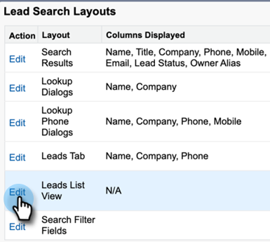

# Uninstall [!DNL Salesforce] Classic Customization Package {#uninstall-salesforce-classic-customization-package}

Uninstall the Marketo [!DNL Sales Connect] package from your [!DNL Salesforce] account once you start using the MSI Actions package.  

## Remove [!DNL Sales Connect] fields from Page Layout {#remove-sales-connect-fields-from-page-layout}

1. In [!DNL Salesforce] Classic, click **[!UICONTROL Setup]**.

   

1. In the left nav, under [!UICONTROL Build], expand (but don't click on) [!UICONTROL Customize], then [!UICONTROL Leads]. Then, select **[!UICONTROL Page Layouts]**.

   

1. Click **[!UICONTROL Edit]** next to Lead Layout.

   

1. In the console, select **[!UICONTROL Fields]**. In Quick Find, search "MSC." All the grayed out fields have been added to your page layout. You'll have to delete them.

   

   >[!NOTE]
   >
   >If none of the fields are grayed out, it means you haven't added them to your page layout. You can skip this section.

1. Scroll to the section that has your [!DNL Sales Connect] Custom Fields.  

   

1. There are 10 types of MSC fields that can be added to this section. Remove all the fields you added, or simply delete the entire section.

1. Click **[!UICONTROL Quick Save]** when done.

   

## Remove [!DNL Sales Connect] Buttons from Page Layouts {#remove-sales-connect-buttons-from-page-layouts}

1. In the console (Step 4 above), select **[!UICONTROL Buttons]**. Search "MSC." All the grayed out buttons have been added to your custom button section. You'll have to delete them.

   

   >[!NOTE]
   >
   >If none of the buttons are grayed out, it means you haven't added them. You can skip this section.

1. Drag and drop the MSC buttons from the [!UICONTROL Custom Buttons] section to the console.

   

1. Click **[!UICONTROL Quick Save]** when done.

   

## Remove [!DNL Sales Connect] Fields from [!UICONTROL Activity History] Section {#remove-sales-connect-fields-from-activity-history-section}

1. Scroll to the bottom of the page to the [!UICONTROL Activity History] related list section and click on the Wrench icon.

   

1. Select the [!DNL Sales Connect] Fields from the [!UICONTROL Selected Fields] area and Click the [!UICONTROL Remove] arrow. Click **[!UICONTROL OK]** when done.  

   

   >[!NOTE]
   >
   >The abbrevation MSE _is_ [!DNL Sales Connect]. It's just the previous name, "Marketo Sales Engage."

1. Click **[!UICONTROL Save]** when you’re done with the Leads page.

## Remove [!DNL Sales Connect] Bulk Action Buttons from Lead List View {#remove-sales-connect-bulk-action-buttons-from-lead-list-view}

1. In the left nav, under [!UICONTROL Build], expand (but don't click on) [!UICONTROL Customize], then [!UICONTROL Leads]. Then, select **[!UICONTROL Search Layouts]**.

   

1. Next to Leads List View, click **[!UICONTROL Edit]**.  

   

1. Select **[!UICONTROL Add to MSC Campaign (Classic)]**, **[!UICONTROL Email with MSC (Classic)]**, and **[!UICONTROL Push to MSC (Classic)]**, and click the [!UICONTROL Remove] arrow. Then click **[!UICONTROL Save]**.  

   

You should no longer see the buttons on the lead list view.

## Remove MSC Configuration for Contacts {#remove-msc-configuration-for-contacts}

1. In [!DNL Salesforce], click **[!UICONTROL Setup]**.

1. In the left nav, under [!UICONTROL Build], expand (but don't click on) [!UICONTROL Customize], then [!UICONTROL Contacts]. Then, select **[!UICONTROL Page Layouts]**.

1. Next to Contact Layout, click **[!UICONTROL Edit]**.

1. Repeat steps from all three sections.

## Remove MSC Configuration for Opportunity {#remove-msc-configuration-for-opportunity}

1. In [!DNL Salesforce], click **[!UICONTROL Setup]**.

1. In the left nav, under [!UICONTROL Build], expand (but don't click on) [!UICONTROL Customize], then [!UICONTROL Opportunities]. Then, select **[!UICONTROL Page Layouts]**.

1. Next to Opportunity Layout, click **[!UICONTROL Edit]**.

1. Repeat steps from all three sections.

Opportunity view has only one button – “Send MSE Email” and the following fields:

   

## Remove MSC Configuration for Account {#remove-msc-configuration-for-account}

1. In [!DNL Salesforce], click **[!UICONTROL Setup]**.

1. In the left nav, under [!UICONTROL Build], expand (but don't click on) [!UICONTROL Customize], then [!UICONTROL Account]. Then, select **[!UICONTROL Page Layouts]**.

1. Next to Account Layout, click **[!UICONTROL Edit]**.

1. Repeat steps from all three sections.

Account view has only one button – “Send MSE Email” and the following fields:

   

## Remove Marketo Sales Outbox {#remove-marketo-sales-outbox}

1. In [!DNL Salesforce], click the **+** tab on the top of your screen.

1. Click **[!UICONTROL Customize My Tabs]**.

1. Select the Marketo Sales Outbox option from the right. Click the [!UICONTROL Remove] arrow, then click **[!UICONTROL Save]**.

## Delete [!DNL Sales Connect] Package {#delete-sales-connect-package}

Once you’ve removed all the objects from your [!DNL Salesforce] Account, follow the steps below.

1. In [!DNL Salesforce], click **[!UICONTROL Setup]**.

1. In the Quick Find box, enter "Apex Classes."

1. Click **[!UICONTROL Delete]** next to all “MarketoSalesConnectionCustomization” or “MarketoSalesEngageCustomization” entries on your list.  

You’re all set!  

Here’s a list of all the objects that need to be removed from your [!DNL Salesforce] instance:

## [!DNL Sales Connect] Customization Details {#sales-connect-customization-details}

<table>
 <tr>
  <th>Custom Activity Fields</th>
  <th>Description</th>
  <th>Type</th>
  <th>Data Type</th>
 </tr>
 <tr>
  <td>[!UICONTROL MSC Call Local Presence ID]</td>
  <td>As a user, I can choose Local Presence as an option when I make calls from MSC Phone. Incoming calls will show a local number for the receiver</td>
  <td>Activity</td>
  <td>Text</td>
 </tr>
 <tr>
  <td>[!UICONTROL MSC Call Recording URL]</td>
  <td>Calls can be recorded and a link for the recording will be logged here </td>
  <td>Activity</td>
  <td>Text</td>
 </tr>
 <tr>
  <td>[!UICONTROL MSC Campaign]</td>
  <td>Logs name of the MSC campaign the contact/lead is on</td>
  <td>Activity</td>
  <td>Text</td>
 </tr>
 <tr>
  <td>[!UICONTROL MSC Campaign URL]</td>
  <td>Logs URL to the campaign that was created in MSC. Clicking on this will open the campaign in the MSC web app</td>
  <td>Activity</td>
  <td>Text</td>
 </tr>
 <tr>
  <td>[!UICONTROL MSC Campaign Current Step]</td>
  <td>If a contact/lead is on a campaign, this field will log the name of the step they're currently on</td>
  <td>Activity</td>
  <td>Checkbox</td>
 </tr>
 <tr>
  <td>[!UICONTROL MSC Email Attachment Viewed]</td>
  <td>Logs data when an email is sent with an attachment that is viewed by the recipient</td>
  <td>Activity</td>
  <td>Checkbox</td>
 </tr>
 <tr>
  <td>[!UICONTROL MSC Email Clicked]</td>
  <td>Logs a check mark when the recipient clicks a link in the email</td>
  <td>Activity</td>
  <td>Checkbox</td>
 </tr>
 <tr>
  <td>[!UICONTROL MSC Email Replied]</td>
  <td>Logs a check mark when the recipient replies to the email</td>
  <td>Activity</td>
  <td>Text</td>
 </tr>
 <tr>
  <td>[!UICONTROL MSC Email Status]</td>
  <td>Shows if an email is sent/in progress/bounced (tracking bounced emails depends on the delivery channel used)</td>
  <td>Activity</td>
  <td>Text</td>
 </tr>
 <tr>
  <td>[!UICONTROL MSC Email Template]</td>
  <td>Logs name of the MSC template that was used in the email sent to the lead/contact</td>
  <td>Activity</td>
  <td>Text</td>
 </tr>
 <tr>
  <td>[!UICONTROL MSC Email Template URL]</td>
  <td>Logs URL to the template that was created in MSC. Clicking on this will open the template in the MSC web app</td>
  <td>Activity</td>
  <td>Text</td>
 </tr>
 <tr>
  <td>[!UICONTROL MSC Email URL]</td>
  <td>Clicking on this URL will open the command center in MSC and pull up the People Detail View history tab where the user can see the sent email</td>
  <td>Activity</td>
  <td>Text</td>
 </tr>
 <tr>
  <td>[!UICONTROL MSC Email Viewed]</td>
  <td>Logs a check mark when the recipient views an email</td>
  <td>Activity</td>
  <td>Checkbox</td>
 </tr>
</table>

<table>
 <tr>
  <th>MSC Roll up Logging Field</th>
  <th>Description</th>
  <th>Type</th>
  <th>Data Type</th>
 </tr>
 <tr>
  <td>MSC - Last Marketing Engagement</td>
  <td>Last incoming engagement from Marketing</td>
  <td>
  
Account 
  
Contact 
  
Lead 
  
Opportunity</td>
  <td>Data and Time</td>
 </tr>
 <tr>
  <td>MSC - Last Marketing Engagement Date</td>
  <td>Time stamp of engagement from Marketing</td>
  <td>
  
Account 
  
Contact 
  
Lead 
  
Opportunity</td>
  <td>Data and Time</td>
 </tr>
 <tr>
  <td>MSC - Last Marketing Engagement Desc</td>
  <td>Description of the engagement</td>
  <td>
  
Account 
  
Contact 
  
Lead 
  
Opportunity</td>
  <td>Text</td>
 </tr>
 <tr>
  <td>MSC - Last Marketing Engagement Source</td>
  <td>Source of Marketing engagement</td>
  <td>
  
Account 
  
Contact 
  
Lead 
  
Opportunity</td>
  <td>Text</td>
 </tr>
 <tr>
  <td>MSC - Last Marketing Engagement Type</td>
  <td>Type of Engagement (ex: Web activity)</td>
  <td>
  
Account 
  
Contact 
  
Lead 
  
Opportunity</td>
  <td>Text</td>
 </tr>
 <tr>
  <td>MSC - Last Activity by Sales</td>
  <td>Last outgoing activity performed by the sales team</td>
  <td>
  
Account 
  
Contact 
  
Lead 
  
Opportunity</td>
  <td>Data and Time</td>
 </tr>
 <tr>
  <td>MSC - Last Replied</td>
  <td>Last email reply to Sales email</td>
  <td>
  
Account 
  
Contact 
  
Lead 
  
Opportunity</td>
  <td>Data and Time</td>
 </tr>
 <tr>
  <td>MSC - Current Sales Campaign</td>
  <td>Logs name of the MSC campaign the contact/lead is on</td>
  <td>
  
Account 
  
Contact 
  
Lead 
  
Opportunity</td>
  <td>Text</td>
 </tr>
 <tr>
  <td>MSC - Last Sales Engagement</td>
  <td>Last incoming engagement from Sales</td>
  <td>
  
Account 
  
Contact 
  
Lead 
  
Opportunity</td>
  <td>Data and Time</td>
 </tr>
 <tr>
  <td>MSC - Opt Out</td>
  <td>Opt out field</td>
  <td>
  
Account 
  
Contact 
  
Lead 
  
Opportunity</td>
  <td>Checkbox</td>
 </tr>
</table>

<table>
 <tr>
  <th>MSC Buttons</th>
  <th>Description</th>
  <th>Type</th>
 </tr>
 <tr>
  <td>[!UICONTROL Send MSC Email]</td>
  <td>Send sales emails from [!DNL Salesforce]</td>
  <td>
  
Account 
  
Contact 
  
Lead 
  
Opportunity</td>
 </tr>
 <tr>
  <td>[!UICONTROL Add to MSC Campaign]</td>
  <td>Add to MSC campaigns from [!DNL Salesforce]</td>
  <td>
  
Contact
  
Lead</td>
 </tr>
 <tr>
  <td>[!UICONTROL Push to MSC]</td>
  <td>Push contact from [!DNL Salesforce] to MSC</td>
  <td>
  
Contact
  
Lead</td>
 </tr>
 <tr>
  <td>[!UICONTROL Call with MSC]</td>
  <td>Make sales calls from [!DNL Salesforce]</td>
  <td>
  
Contact
  
Lead</td>
 </tr>
</table>

<table>
 <tr>
  <th>MSC Bulk Action Buttons</th>
  <th>Description</th>
  <th>Type</th>
 </tr>
 <tr>
  <td>[!UICONTROL Add to MSC Campaign (Classic)]</td>
  <td>Add to MSC campaigns from [!DNL Salesforce]</td>
  <td>
  
Contact
  
Lead</td>
 </tr>
 <tr>
  <td>[!UICONTROL Push to MSC (Classic)]</td>
  <td>Push contact from [!DNL Salesforce] to MSC</td>
  <td>
  
Contact
  
Lead</td>
 </tr>
 <tr>
  <td>[!UICONTROL Email with MSC (Classic)]</td>
  <td>Email with MSC from [!DNL Salesforce]</td>
  <td>
  
Contact
  
Lead</td>
 </tr>
</table>
