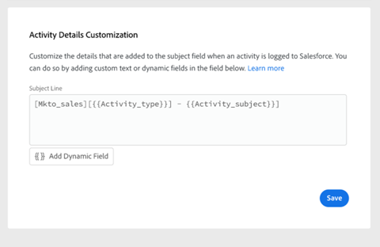
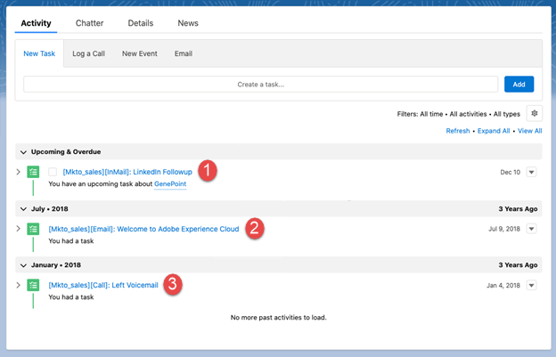
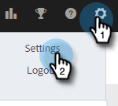
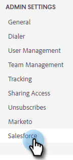
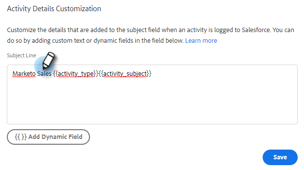
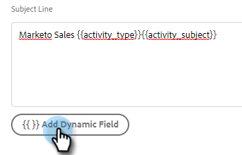
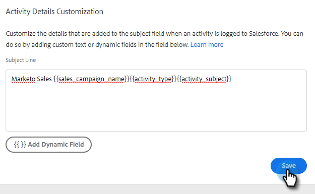

# Configure Salesforce Activity Detail Customization {#configure-salesforce-activity-detail-customization}

>[!PREREQUISITES]
>
>* Salesforce and Sales Insight Actions [must be connected](/help/marketo/product-docs/marketo-sales-insight/actions/crm/salesforce-integration/connect-your-marketo-sales-account-to-salesforce.md)
>* Logging email activity via API [must be enabled](/help/marketo/product-docs/marketo-sales-insight/actions/crm/salesforce-integration/salesforce-sync-settings.md)

Activity Detail Customization allows Admins to configure the information that will log to the Salesforce Task - Subject Field, when a Sales Insight Actions activity/reminder task is synced to Salesforce.

>[!NOTE]
>
>* Updates made to the subject field in Sales Insight Actions of a reminder task will be reflected in the corresponding Salesforce task's subject field, if you're using the `{{activity_subject}}` dynamic field in your Activity Detail Customization.
>* Line breaks are not supported when logging information to the Salesforce subject field. Any line breaks in the Activity Detail Customization editor will be removed when a sales task subject is updated.

<table>
 <tr>
  <td><strong>1</td>
  <td>InMail Reminder Task</td>
 </tr>
 <tr>
  <td><strong>2</td>
  <td>Email Activity</td>
 </tr>
 <tr>
  <td><strong>3</td>
  <td>Call Activity</td>
 </tr>
</table>

The feature can be used to unlock the following benefits:

* By customizing what information is visible on the subject field, activity details are easily scannable for sales in Salesforce.
* Admins can tag the subject field with a unique identifier such as “Mkto_sales” so activities from Sales Insight Actions can be easily identified and differentiated from other email activities, call activities, and tasks.
* Reduce the need for custom activity fields. Salesforce enforces limits on the number of custom activity fields, which can restrict what data is available to be used in reports. By using activity dynamic fields to add key data to the subject line you can reduce the number of custom activity fields you need created in your Salesforce instance.  
* The subject field of activities and tasks will follow a consistent pattern defined by the Sales Insight Actions Admin.

>[!NOTE]
>
>If you're logging email replies as activities to Salesforce, they will not use the Salesforce Activity Detail Customization settings. Instead they, will log as "Reply: Email Subject."

## Activity Dynamic Fields Supported {#activity-dynamic-fields-supported}

Activity Dynamic Fields reference information about your sales activities to populate data. Today, they can be used with Salesforce Activity Detail Customization.

>[!NOTE]
>
>If there's no value to populate the dynamic field for a specific activity/task, it will not populate any data for that dynamic field when the Salesforce Task – Subject Field is updated.  

<table>
 <tr>
  <th>Field</th>
  <th>Description</th>
 </tr>
 <tr>
  <td>{{activity_type}}</td>
  <td>Will populate the task type as Email, Call, InMail, or Custom.</td>
 </tr>
 <tr>
  <td>{{activity_subject}}</td>
  <td>
Will populate the subject of the task.

      
In the case of an email it will populate the subject line of the email.

      
In the case of call, inMail, or custom, it will populate a value if there was a reminder task created with a value in the task name/subject field.
</td>
 </tr>
 <tr>
  <td>{{sales_campaign_name}}</td>
  <td>If the activity was initiated from a sales campaign, it will populate the name of the sales campaign.</td>
 </tr>
 <tr>
  <td>{{sales_campaign_day}}</td>
  <td>If the activity was initiated from a sales campaign, it will populate the sales campaign day number this activity occurred on.</td>
 </tr>
 <tr>
  <td>{{sales_campaign_step}}</td>
  <td>If the activity was initiated from a sales campaign, it will populate the step number within the sales campaign day this activity occurred on.</td>
 </tr>
 <tr>
  <td>{{call_outcome}}</td>
  <td>If the activity is a call and a call outcome is selected, this will populate the call outcome value.</td>
 </tr>
 <tr>
  <td>{{call_reason}}</td>
  <td>If the activity is a call and a call reason is selected, this will populate the call reason value.</td>
 </tr>
</table>

## Configuring Salesforce Activity Detail Customization {#configuring-salesforce-activity-detail-customization}

>[!NOTE]
>
>**Admin permissions required.**

When configuring your activity details, consider what data would be most relevant to sales when reviewing task history in Salesforce.

1. Click the gear icon and select **Settings**.

   

1. Click **Salesforce**.

   

1. Click **Sync Settings**.

   

1. In the Activity Details Customization editor add any free text you want. Text you add is non-dynamic and will remain unchanged for the subject field of all tasks synced to Salesforce.

   

   >[!TIP]
   >
   >Although not required, wrapping added text in straight brackets can make it easier for some people to discern between the data when it's populated to a subject field in Salesforce. Example: `[Sales Insight Actions] - {{Activity_type}}`

1. Add any additional dynamic fields you'd like by clicking the **Add Dynamic Field** button.

   

1. Select the desired dynamic field(s).

   

1. Click **Save**.

   

>[!NOTE]
>
>Salesforce enforces a 255 character limit. If your activity detail exceeds that, it will be truncated to ensure the information gets stored on the Salesforce subject field.  

>[!MORELIKETHIS]
>
>* [Sync Settings](/help/marketo/product-docs/marketo-sales-insight/actions/crm/salesforce-integration/salesforce-sync-settings.md)
>* [Reminder Task Sync with Salesforce](/help/marketo/product-docs/marketo-sales-insight/actions/tasks/reminder-task-sync-with-salesforce.md)
