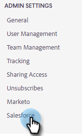
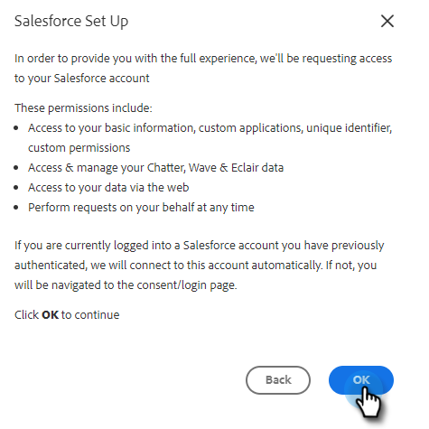
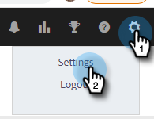
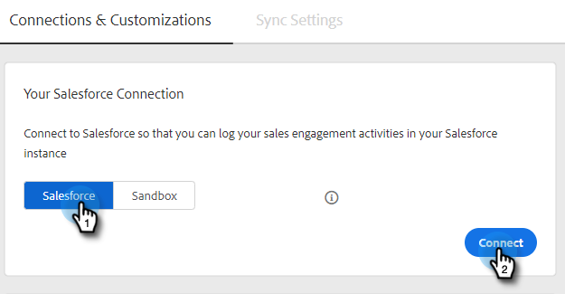

# Connect Your [!DNL Sales Insight Actions] Account to [!DNL Salesforce] {#connect-your-sales-insight-actions-account-to-salesforce}

Follow these simple steps to connect [!DNL Sales Insight Actions] account to [!DNL Salesforce].

## How to Connect as an Admin {#how-to-connect-as-an-admin}

1. Click the gear icon and select **[!UICONTROL Settings]**.

   

1. Under [!UICONTROL Admin Settings], click **[!UICONTROL Salesforce]**.

   

1. In the [!UICONTROL Connections & Customizations] tab, click **[!UICONTROL Salesforce]** then **[!UICONTROL Connect]**.

   

1. Click **[!UICONTROL OK]**.

   

1. If you’re already logged in to [!DNL Salesforce], you'll be connected. If you're not, you’ll be asked to log in.

## How to Connect as a non-Admin {#how-to-connect-as-a-non-admin}

1. Click the gear icon and select **[!UICONTROL Settings]**.

   

1. Under [!UICONTROL My Account], select **[!UICONTROL Salesforce]**.

1. In the [!UICONTROL Connections & Customizations tab], click **[!UICONTROL Salesforce]** then **[!UICONTROL Connect]**.

   

1. Click **[!UICONTROL OK]**.

      

1. If you’re already logged in to [!DNL Salesforce], you'll be connected. If you're not, you’ll be asked to log in.
