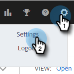
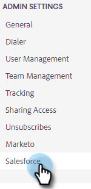
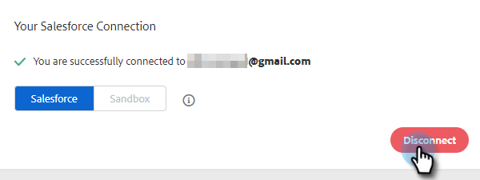
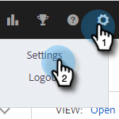

# Disconnect [!DNL Salesforce] From [!DNL Sales Insight Actions] {#disconnect-salesforce-from-sales-insight-actions}

Sometimes you may need to disconnect your [!DNL Salesforce] account from your [!DNL Sales Insight Actions] account. Here's how.

## How to Disconnect From [!UICONTROL Salesforce] as an Admin {#how-to-disconnect-from-salesforce-as-an-admin}

1. In [!DNL Sales Insight Actions], click the gear icon on the upper-right and select **[!UICONTROL Settings]**.

   

1. Under [!UICONTROL Admin Settings], click **[!UICONTROL Salesforce]**.

   

1. In the [!UICONTROL Connections & Customizations] tab, click **[!UICONTROL Disconnect]**.

   

## How to Disconnect From [!DNL Salesforce] as a non-Admin {#how-to-disconnect-from-salesforce-as-a-non-admin}

1. In [!DNL Sales Insight Actions], click the gear icon on the upper-right and select **[!UICONTROL Settings]**.

   

1. Under [!UICONTROL My Account], select **[!UICONTROL Salesforce]**.

PICC

1. In the [!UICONTROL Connections & Customizations] tab, click **[!UICONTROL Disconnect]**.

PICC
