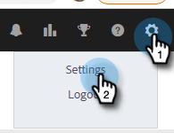
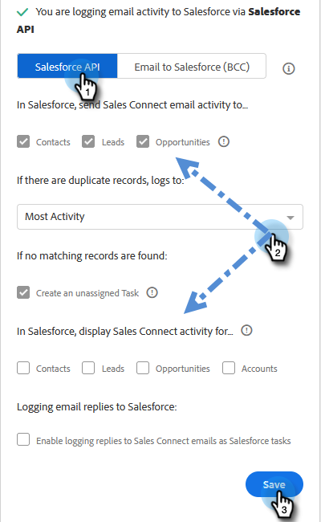
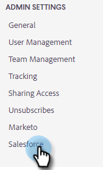

# [!DNL Salesforce] Sync Settings {#salesforce-sync-settings}

## Logging Email Activity to [!DNL Salesforce] via API {#logging-email-activity-to-salesforce-via-api}

This functionality requires you to be on the Enterprise/Unlimited edition of [!DNL Salesforce], or the Professional edition if you've purchased Integration via Web Services API.

>[!PREREQUISITES]
>
>[!DNL Salesforce] and [!DNL Sales Insight Actions] must be connected.

1. In [!DNL Sales Insight Actions], click the gear icon and select **[!UICONTROL Settings]**.

   

1. Under [!UICONTROL Admin Settings] (or "[!UICONTROL My Account]" if you're not an Admin), click **[!UICONTROL Salesforce]**.

   

1. Click the **[!UICONTROL Sync Settings]** tab.

   

1. Click the arrow next to [!UICONTROL Log Email Activity] to [!DNL Salesforce].

   

1. Click the **[!UICONTROL Salesforce API]** tab. In this card you can set up your preference for logging information to [!DNL Salesforce]. Click **[!UICONTROL Save]** when done.

   

## Logging Email Activity to [!DNL Salesforce] via Email to [!DNL Salesforce] (BCC) {#logging-email-activity-to-salesforce-via-email-to-salesforce-bcc}

Once you activate “[!UICONTROL Email to Salesforce (BCC)]”, you'll receive a BCC of your sales emails and your emails will be logged as activities on opportunities, leads and contacts.

>[!PREREQUISITES]
>
>[!DNL Salesforce] and [!DNL Sales Insight Actions] must be connected.

**To log your emails in [!DNL Salesforce] via Email (BCC)**

1. In Marketo Sales, click the gear icon and select **[!UICONTROL Settings]**.

   

1. Under [!UICONTROL Admin Settings] (or "[!UICONTROL My Account]" if you're not an Admin), click **[!UICONTROL Salesforce]**.

   

1. Click the **[!UICONTROL Sync Settings]** tab.

   

1. Click the **[!UICONTROL Email to Salesforce (BCC)]** tab and click **[!UICONTROL Activate]**.

   

If for some reason your Email to [!DNL Salesforce] address does not pull in, follow these steps to activate the BCC feature in your [!DNL Salesforce] account:

1. Log in to your [!DNL Salesforce] instance.
1. Find your user name in the upper-right corner and select the drop-down bar.
1. Select **[!UICONTROL My Settings]**.
1. Select **[!UICONTROL Email]**.
1. Select **[!UICONTROL My Email to Salesforce]**.
1. On this page, you'll see a field labeled "[!UICONTROL Email to Salesforce Address]." If there is nothing populated next to it, scroll down to "[!UICONTROL My Acceptable Email Addresses]."
1. Enter the email address(es) that you want BCC'd.
1. Click **[!UICONTROL Save Changes]**.

**Can't Find My Email to [!DNL Salesforce] in My Settings**

If you don't see My Email to [!DNL Salesforce] under your Settings, your Admin may not have enabled it. This can happen if your team is new to [!DNL Salesforce], or your team has never used the BCC address that [!DNL Salesforce] provides.

>[!NOTE]
>
>You will need Admin privileges to set this up.

1. Click **[!UICONTROL Setup]**.
1. Click **[!UICONTROL Email Administration]**.
1. Click **[!UICONTROL Email to Salesforce]**.
1. Click **[!UICONTROL Edit]**.
1. Check the box next to "Active."
1. Click **[!UICONTROL Save]**.

## Sync [!DNL Sales Insight Actions] Tasks/Reminders to [!DNL Salesforce] Tasks {#sync-sales-insight-actions-tasks-reminders-to-salesforce-tasks}

1. In [!DNL Sales Insight Actions], click the gear icon and select **[!UICONTROL Settings]**.

   

1. Under [!UICONTROL Admin Settings] (or "[!UICONTROL My Account]" if you're not an Admin), click **[!UICONTROL Salesforce]**.

   

1. Click the **[!UICONTROL Sync Settings]** tab.

   

1. Click the arrow next to Sync Marketo Sales Tasks/Reminders to [!DNL Salesforce] Tasks.

   

1. Choose the desired option ("Do not sync to [!DNL Salesforce] tasks" is selected by default).

   

## Syncing [!DNL Sales Insight Actions] Tasks with [!DNL Salesforce] for the First Time {#syncing-sales-insight-ations-tasks-with-salesforce-for-the-first-time}

When you first turn on the sync between [!DNL Sales Insight Actions] and [!DNL Salesforce] tasks, we import your [!DNL Salesforce] tasks. We will not push over any current tasks you have in [!DNL Sales Insight Actions] to [!DNL Salesforce]. To reduce clutter and duplicates, the only tasks that get synced from [!DNL Sales Insight Actions] into [!DNL Salesforce] are tasks created after you sync [!DNL Sales Insight Actions] with SFDC.

Here’s what happens when you sync [!DNL Sales Insight Actions] and SFDC tasks:

As soon as you click save on tasks syncing, they begin to sync over. This will take some time initially.

Any reminders that have been updated or created in the last 24 hours will be pulled in from SFDC to [!DNL Sales Insight Actions]. The sync is based on due date and all of those tasks will get synced over on the back-end, but in Command Center, you will only see tasks due today and tomorrow.

If sync has been turned on previously and you delete any tasks in SFDC, anything that’s been deleted in the last 15 days will be deleted from Command Center.

We’ll constantly sync tasks between [!DNL Sales Insight Actions] and SFDC as long as the sync is enabled.

After the initial sync, any tasks you create, edit, complete, or delete in [!DNL Sales Insight Actions] will sync over to your tasks list in [!DNL Salesforce]. And anything created, edited, completed, or deleted in [!DNL Salesforce] will update your tasks list in [!DNL Sales Insight Actions].

To turn on this sync, just check the sync box in your [!UICONTROL Settings] page in the web application.
