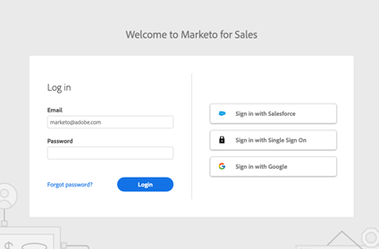

# Set up a Sales Insight Actions Sandbox {#set-up-a-sales-insight-actions-sandbox}

>[!NOTE]
>
>Marketo Sales Insight Actions is a web-based application that integrates with the Salesforce user interface via the [Marketo Sales Insight package](/help/marketo/product-docs/marketo-sales-insight/msi-for-salesforce/installation/install-marketo-sales-insight-package-in-salesforce-appexchange.md){target="_blank"}. It is sometimes referred to as "Marketo Sales," or simply "Actions."

If you have a Marketo Sandbox, you can enable an Actions instance to be used with your sandbox for testing purposes.

When setting up an Actions instance, you must decide whether it will be configured to work with Salesforce Sandbox or Salesforce production. This is because Salesforce uses different endpoints for each, and Actions uses the connection to Salesforce for activating and authenticating users.

Follow the steps below to get an Actions instance set up to work with your Salesforce Sandbox instance.

>[!NOTE]
>
>You can learn more about how users will [activate their Actions seat](/help/marketo/product-docs/marketo-sales-insight/actions/getting-started/sales-insight-actions-user-onboarding-checklist.md){target="_blank"}. You can also learn about how users will [authenticate with Salesforce](/help/marketo/product-docs/marketo-sales-insight/actions/admin/auto-login-from-salesforce.md){target="_blank"}. Additionally, if you prefer to have users authenticate with email and password, you can learn more about this in our [Login Management settings article](/help/marketo/product-docs/marketo-sales-insight/actions/admin/login-management-settings.md){target="_blank"}.

## Request an Actions Instance to be Provisioned to Your Marketo Sandbox {#request=an-actions-instance}

Sales Insight Actions is not enabled for Marketo Sandbox instances unless requested. Contact the Adobe Account Team (your Account Manager) to submit a request.

## Provision Your Actions Account for Marketo Sandbox {#provision-your-actions-account}

Once Actions is enabled for your Marketo Sandbox, you'll need to follow the steps below to activate your new instance.

1. Log in to your Marketo Sandbox instance.

1. Navigate to **Admin**.

1. Select **Sales Insight**.

1. Select **Actions Config**.

   >[!IMPORTANT]
   >
   >An email address can only be used for one Actions instance across both Sandbox and Production instances. If you're an admin who will need access to multiple instances across Production and Sandbox, you must use a different email address for each.

1. In the provisioning card, select the user you want to invite to your Sales Insight Actions instance.

## Activate Your Actions Instance {#activate-your-actions-instance}

Your Actions instance will need to be activated with a Salesforce production account. After it's activated, it can be switched to a Salesforce Sandbox account.

1. Locate the invite sent.

1. Click the **Get Started** Link.

1. Activate with your Salesforce Production instance.

1. Follow the prompts to set up the account. For a detailed overview, check out our [User Onboarding article](/help/marketo/product-docs/marketo-sales-insight/actions/getting-started/sales-insight-actions-user-onboarding-guide.md){target="_blank"}.

## Prepare Your Actions Instance to be Compatible with Your Salesforce Sandbox instance {#prepare-your-actions-instance}

Actions requires you to activate a new instance with a Salesforce production user first. Once activated, you can use the following steps to prepare your instance to be Salesforce Sandbox compatible.

1. Update login settings to "All Login Methods," so you can log in with a username and password if needed. If preferred, this can be switched back to "Salesforce Only" after everything is configured. [See how to do this here](/help/marketo/product-docs/marketo-sales-insight/actions/admin/login-management-settings.md){target="_blank"}.

1. Disconnect from Salesforce Production and connect to your Salesforce Sandbox. [See how to connect here](/help/marketo/product-docs/marketo-sales-insight/actions/crm/salesforce-integration/connect-your-sales-insight-actions-account-to-salesforce.md){target="_blank"}. For step 3, select "Sandbox" instead of "Salesforce". If you're already connected, you should see an option to disconnect on the Salesforce Connections and Customizations tab.

>[!NOTE]
>
>If you have a custom domain for your Salesforce instance, we recommend being logged in to your Salesforce instance before connecting to Salesforce or logging in to Actions.

## Request Your Actions Instance be Converted to be compatible with Your Salesforce Sandbox {#request-your-actions-instance-be-converted}

1. Contact [Marketo Engage Support](https://nation.marketo.com/t5/support/ct-p/Support){target="_blank"} to request your new Sales Insight Actions instance be configured to be compatible with Salesforce Sandbox.

1. Test everything is configured correctly by trying to log in using the "Sign in with Salesforce" button on the toutapp.com/login page.

   

   >[!TIP]
   >
   >If you run into any issues at this point, you can request a password reset and use a password to regain access to your account.

Now your instance is ready to be used with your Salesforce Sandbox instance. If you'd like to use [Salesforce auto-login](/help/marketo/product-docs/marketo-sales-insight/actions/admin/auto-login-from-salesforce.md){target="_blank"} from Salesforce, you can switch back to "Salesforce Only" in your [Login Management settings](/help/marketo/product-docs/marketo-sales-insight/actions/admin/login-management-settings.md){target="_blank"}.

>[!NOTE]
>
>* [Connect Your Sales Insight Actions Account to Salesforce](/help/marketo/product-docs/marketo-sales-insight/actions/crm/salesforce-integration/connect-your-sales-insight-actions-account-to-salesforce.md){target="_blank"}
>* [Sales Insight Actions User Onboarding Guide](/help/marketo/product-docs/marketo-sales-insight/actions/getting-started/sales-insight-actions-user-onboarding-guide.md){target="_blank"}
>* [Auto Login from Salesforce](/help/marketo/product-docs/marketo-sales-insight/actions/admin/auto-login-from-salesforce.md){target="_blank"}
>* [Login Management Settings](/help/marketo/product-docs/marketo-sales-insight/actions/admin/login-management-settings.md){target="_blank"}
