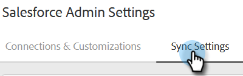
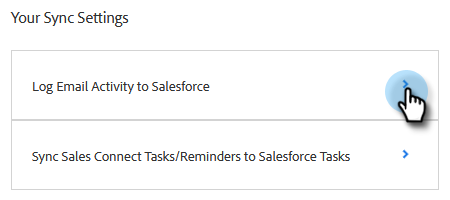
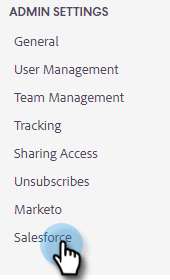
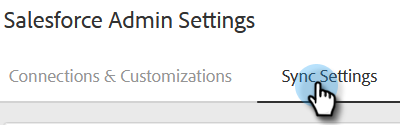
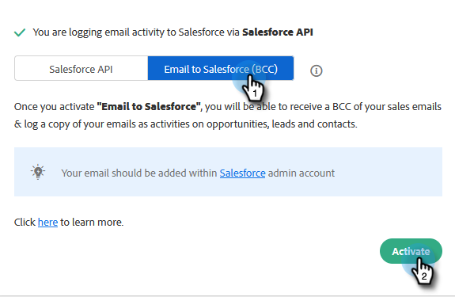
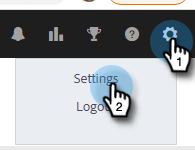
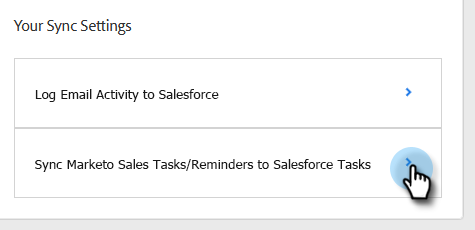
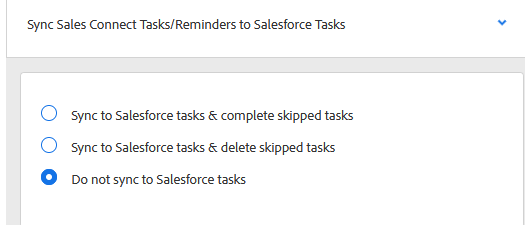

# Sync Sales Activities to Salesforce {#sync-sales-activities-to-salesforce}

You can configure the Actions Salesforce Sync Settings to log email and call activities to Salesforce. This provides better visibility to teams working out of your CRM and allows managers to use these activities to build custom Salesforce reports to track your teams performance.

## Logging Email Activity to Salesforce via API {#logging-email-activity-to-salesforce-via-api}

This functionality requires you to be on the Enterprise/Unlimited edition of Salesforce, or the Professional edition if you've purchased Integration via Web Services API.

>[!PREREQUISITES]
>
>Salesforce and Sales Insight Actions must be connected.

1. In Sales Insight Actions, click the gear icon and select **Settings**.

   

1. Under Admin Settings (or "My Account" if you're not an Admin), click **Salesforce**.

   

1. Click the **Sync Settings** tab.

   

1. Click the arrow next to Log Email Activity to Salesforce.

   

1. Click the **Salesforce API** tab. In this card you can set up your preference for logging information to Salesforce. Click **Save** when done.

   

## Logging Email Activity to Salesforce via Email to Salesforce (BCC) {#logging-email-activity-to-salesforce-via-email-to-salesforce-bcc}

Once you activate "Email to Salesforce (BCC)", you'll receive a BCC of your sales emails and your emails will be logged as activities on opportunities, leads and contacts.

>[!PREREQUISITES]
>
>Salesforce and Sales Insight Actions must be connected.

**To log your emails in Salesforce via Email (BCC)**

1. In Marketo Sales, click the gear icon and select **Settings**.

   

1. Under Admin Settings (or "My Account" if you're not an Admin), click **Salesforce**.

   

1. Click the **Sync Settings** tab.

   

1. Click the **Email to Salesforce (BCC)** tab and click **Activate**.

   

If for some reason your Email to Salesforce address does not pull in, follow these steps to activate the BCC feature in your Salesforce account:

1. Log in to your Salesforce instance.
1. Find your user name in the upper-right corner and select the drop-down bar.
1. Select **My Settings**.
1. Select **Email**.
1. Select **My Email to Salesforce**.
1. On this page, you'll see a field labeled "Email to Salesforce Address." If there is nothing populated next to it, scroll down to "My Acceptable Email Addresses."
1. Enter the email address(es) that you want BCC'd.
1. Click **Save Changes**.

**Can't Find My Email to Salesforce in My Settings**

If you don't see My Email to Salesforce under your Settings, your Admin may not have enabled it. This can happen if your team is new to Salesforce, or your team has never used the BCC address that Salesforce provides.

>[!NOTE]
>
>You will need Admin privileges to set this up.

1. Click **Setup**.
1. Click **Email Administration**.
1. Click **Email to Salesforce**.
1. Click **Edit**.
1. Check the box next to "Active."
1. Click **Save**.

## Sync Sales Insight Actions Tasks/Reminders to Salesforce Tasks {#sync-sales-insight-actions-tasks-reminders-to-salesforce-tasks}

1. In Sales Insight Actions, click the gear icon and select **Settings**.

   

1. Under Admin Settings (or "My Account" if you're not an Admin), click **Salesforce**.

   

1. Click the **Sync Settings** tab.

   

1. Click the arrow next to Sync Marketo Sales Tasks/Reminders to Salesforce Tasks.

   

1. Choose the desired option ("Do not sync to Salesforce tasks" is selected by default).

   

## Syncing Sales Insight Actions Tasks with Salesforce for the First Time {#syncing-sales-insight-ations-tasks-with-salesforce-for-the-first-time}

When you first turn on the sync between Sales Insight Actions and Salesforce tasks, we import your Salesforce tasks. We will not push over any current tasks you have in Sales Insight Actions to Salesforce. To reduce clutter and duplicates, the only tasks that get synced from Sales Insight Actions into Salesforce are tasks created after you sync Sales Insight Actions with SFDC.

Here's what happens when you sync Sales Insight Actions and SFDC tasks:

* As soon as you click save on tasks syncing, they begin to sync over. This will take some time initially.

* Any reminders that have been updated or created in the last 24 hours will be pulled in from SFDC to Sales Insight Actions. The sync is based on due date and all of those tasks will get synced over on the back-end, but in Command Center, you will only see tasks due today and tomorrow.

* If sync has been turned on previously and you delete any tasks in SFDC, anything that's been deleted in the last 15 days will be deleted from Command Center.

* We'll constantly sync tasks between Sales Insight Actions and SFDC as long as the sync is enabled.

* After the initial sync, any tasks you create, edit, complete, or delete in Sales Insight Actions will sync over to your tasks list in Salesforce. And anything created, edited, completed, or deleted in Salesforce will update your tasks list in Sales Insight Actions.

* To turn on this sync, just check the sync box in your Settings page in the web application.
