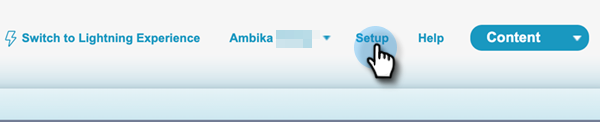
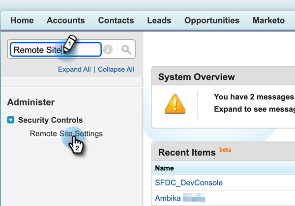
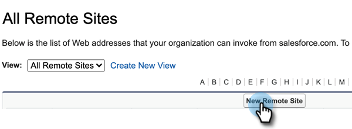
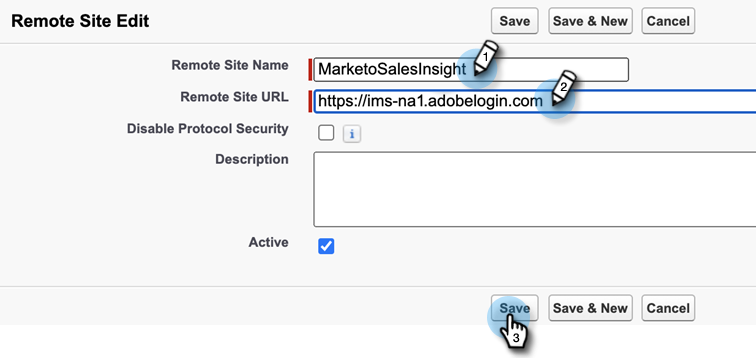
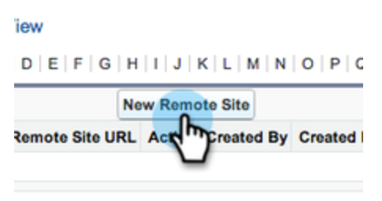
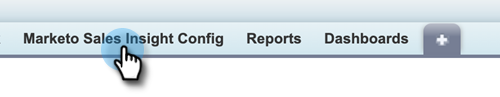
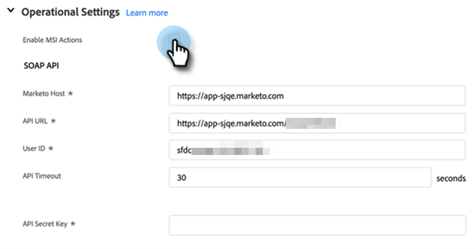
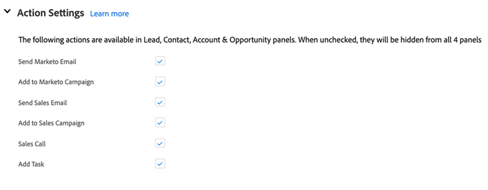

# [!DNL Sales Insight Actions] Configuration in [!DNL Salesforce] {#sales-insight-actions-configuration-in-salesforce}

>[!PREREQUISITES]
>
>* [Install](/help/marketo/product-docs/marketo-sales-insight/msi-for-salesforce/installation/install-marketo-sales-insight-package-in-salesforce-appexchange.md) or [Upgrade](/help/marketo/product-docs/marketo-sales-insight/msi-for-salesforce/upgrading/upgrading-your-msi-package.md) Sales Insight Package in your [!DNL Salesforce] instance
>* [Configure Marketo Sales Insight in [!DNL Salesforce] Enterprise/Unlimited](/help/marketo/product-docs/marketo-sales-insight/msi-for-salesforce/configuration/configure-marketo-sales-insight-in-salesforce-enterprise-unlimited.md)

## Add New Remote Site in [!DNL Salesforce] {#add-new-remote-site-in-salesforce}

1. In [!DNL Salesforce], click **[!UICONTROL Setup]**.

   

1. Search for "[!UICONTROL remote site]" and select **[!UICONTROL Remote Site Settings]**.
   

1. Click **[!UICONTROL New Remote Site]**.

   

1. Enter the Remote Site Name (it can be something like "MarketoSalesInsight1"). Enter the Remote Site URL `https://ims-na1.adobelogin.com` and click **[!UICONTROL Save]**.

   

1. Click **[!UICONTROL New Remote Site]** again.
 
   

1. Enter the Remote Site Name (it can be something like "MarketoSalesInsight2"). Enter Remote Site URL `https://mkto-sales-connect.adobe.io` and click **[!UICONTROL Save]**.

## Enabling [!DNL Sales Insight Actions] across the CRM {#enabling-sales-insight-actions-across-the-crm}

1. In [!DNL Salesforce], click the **[!UICONTROL Marketo Sales Insight Config]** tab.

   

   >[!NOTE]
   >
   >If you don't see "[!UICONTROL Marketo Sales Insight Config]" in your top bar, click the **+** sign and find it under All Tabs.

1. Select the **[!UICONTROL Enable MSI Actions]** checkbox.

   

1. Enter the [!UICONTROL API Secret Key].

   

   >[!NOTE]
   >
   >If you don't have your [!UICONTROL API Secrey Key] handy, you can find it by following the steps in [this article](/help/marketo/product-docs/marketo-sales-insight/msi-for-salesforce/configuration/configure-marketo-sales-insight-in-salesforce-enterprise-unlimited.md).

1. Click **[!UICONTROL Save]** when done.

This will automatically enable all MSI Actions features outlined in the feature overview article.

>[!NOTE]
>
>You can disable all MSI Actions features by simply unchecking the "Enable MSI Actions" checkbox.

## MSI-Actions Governance {#msi-actions-governance}

1. You can disable Sales Campaigns and/or the Task tab in the upcoming section. This will be applicable to lead, contact, account, and opportunity panels.

   

1. You can disable MSI Actions by unchecking corresponding features under [!UICONTROL Actions settings].

   

>[!NOTE]
>
>Governance settings are applicable to all MSI users.
