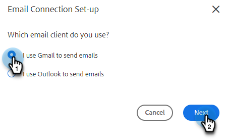
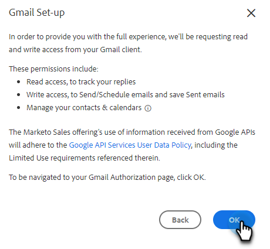
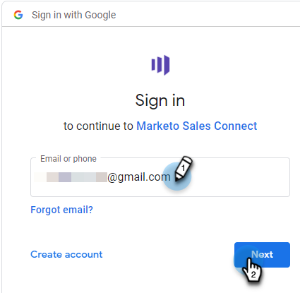
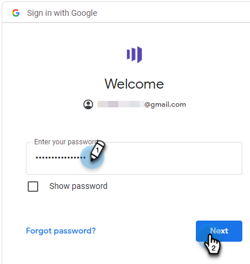

# Connect to Gmail {#connect-to-gmail}

Connecting to Gmail means you'll receive reply tracking, access to the Gmail delivery channel, the ability to schedule emails in Gmail, and send compliance.

>[!CAUTION]
>
>If you're [using filters](https://support.google.com/mail/answer/6579?hl=en#zippy=%2Ccreate-a-filter%2Cedit-or-delete-filters){target="_blank"} or rules in your Gmail account to automatically mark emails as read, this can cause issues with reply tracking. We recommend disabling any rules that automatically mark emails as read when using reply tracking with Gmail.

1. In Marketo Sales, click the gear icon and select **Settings**.

   

1. Under My Account, select **Email Settings**.

   

1. Click the **Email Connection** tab.

   

1. Click **Get Started**.

   

1. Select **I use Gmail to send emails** and click **Next**.

   

1. Click **OK**.

   

1. If you've already logged in to Gmail, choose the account you'd like to connect to. If not, enter your Gmail address and click **Next**. In this example, we're not yet logged in.

   

1. Enter your password and click **Next**.

   

1. Click **Allow**.

   

   You can use this connection to track emails and also as a delivery channel.

>[!NOTE]
>
>Gmail enforces its own sending limits. [Learn more here](/help/marketo/product-docs/marketo-sales-connect/email/email-delivery/email-connection-throttling.md#email-provider-limits).
