# Connect to Outlook {#connect-to-outlook}

Learn how to connect your Sales Insight Actions account with Outlook.

>[!NOTE]
>
>Each user needs to connect to Outlook from their Marketo Sales account.

## Connecting to Outlook Online {#connecting-to-outlook-online}

Connecting to Outlook means you'll receive reply tracking, access to the Outlook delivery channel, the ability to schedule emails in Outlook, and send compliance.

1. In Marketo Sales, click the gear icon and select **Settings**.

   

1. Under My Account, select **Email Settings**.

   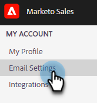

1. Click the **Email Connection** tab.

   

1. Click **Get Started**.

   

1. Select **I use Outlook to send emails** and click **Next**.

   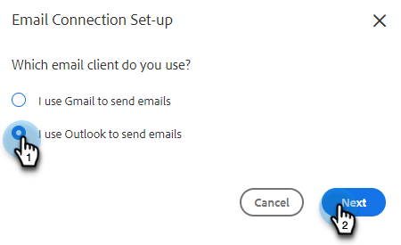

1. Select the version of Outlook you're using and click **Next**. In this example we're choosing Outlook Online.

   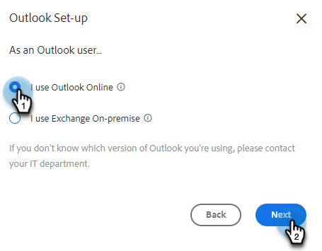

      <table> 
    <tbody>
     <tr>
      <td><strong>Outlook Online</strong></td> 
      <td>Also known as Exchange Online</td> 
     </tr>
     <tr>
      <td><strong>Exchange On-premise</strong></td> 
      <td>Includes Exchange 2013 and 2016</td> 
     </tr>
    </tbody>
   </table>

   >[!NOTE]
   >
   >Marketo does not support Exchange Hybrid accounts at this time.

1. Click **OK**.

   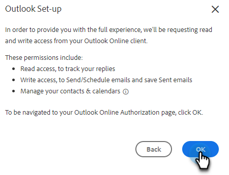

1. If you're not logged in to Outlook, enter your log-in info and click **Next**. If you are, choose the account you'd like to connect to and click **Next**. In this example, we're already logged in.

   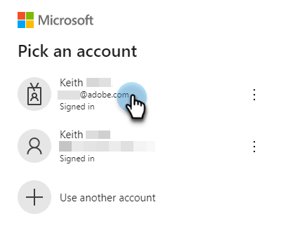

1. Click **Accept**.

   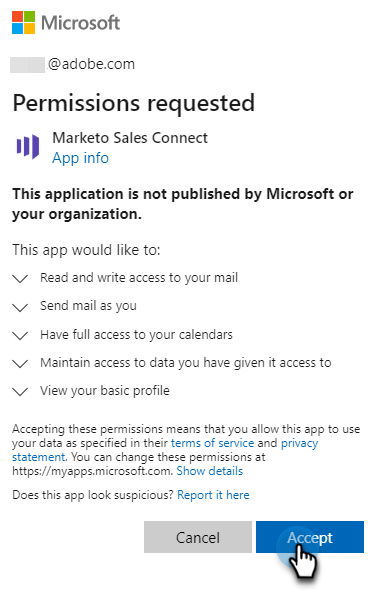

   You can use this connection to track emails and also as a delivery channel.

   >[!NOTE]
   >
   >Outlook Online (Office365) enforces its own sending limits. [Learn more here](/help/marketo/product-docs/marketo-sales-connect/email/email-delivery/email-connection-throttling.md#email-provider-limits).

## Connecting to Exchange On-Premise {#connecting-to-exchange-on-premise}

Connecting to Exchange On-Premise means you'll receive reply tracking, access to the Outlook delivery channel, the ability to schedule emails in Outlook, and send compliance.

1. In Marketo Sales, click the gear icon and select **Settings**.

   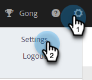

1. Under My Account, select **Email Settings**.

   

1. Click the **Email Connection** tab.

   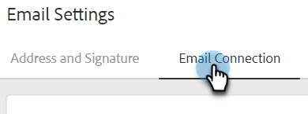

1. Click **Get Started**.

   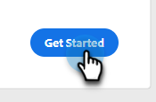

1. Select **I use Outlook to send emails** and click **Next**.

   

1. Select the version of Outlook you're using and click **Next**. In this example we're choosing Exchange On-premise.

   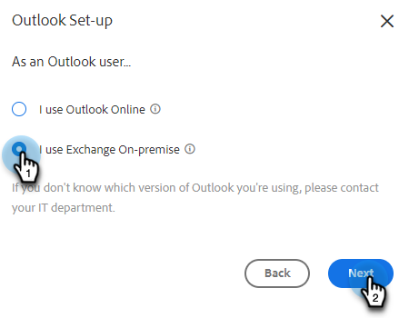

      <table> 
    <tbody>
     <tr>
      <td><strong>Outlook Online</strong></td> 
      <td>Also known as Exchange Online</td> 
     </tr>
     <tr>
      <td><strong>Exchange On-premise</strong></td> 
      <td>Includes Exchange 2013 and 2016</td> 
     </tr>
    </tbody>
   </table>

1. Enter your credentials and click **Connect**.

   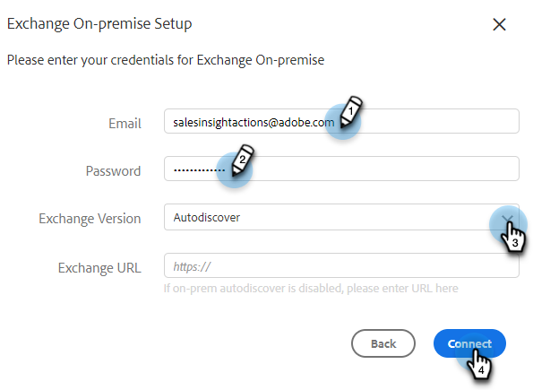

   >[!NOTE]
   >
   >If you turn off Autodiscover in the Exchange Version drop-down, you'll need to ask your IT department for the Exchange URL.

   You can use this connection to track emails and also as a delivery channel.

   >[!NOTE]
   >
   >When using Exchange On-prem, your IT Team will establish your email sending limit.

## Getting Permission to Connect to Outlook Online {#getting-permission-to-connect-to-outlook-online}

You may need to work with your IT team to get permission to allow Marketo Sales to connect to your Outlook Online account (Microsoft 365).

>[!NOTE]
>
>Inform the IT team that manages your Microsoft 365 account that the application that needs access is "Marketo Sales Connect."

Depending on your IT team's preferences and current configuration, it's best to consult with them about how to grant access. Below are some articles that can help guide the conversation.

* Global Consent: [Integrated apps and Azure AD for Microsoft 365 administrators](https://learn.microsoft.com/en-us/microsoft-365/enterprise/integrated-apps-and-azure-ads?view=o365-worldwide){target="_blank"}
* User Consent: [Configure how users consent to applications](https://learn.microsoft.com/en-us/azure/active-directory/manage-apps/configure-user-consent?tabs=azure-portal&pivots=portal){target="_blank"}
* Admin Consent: [Configure the admin consent workflow](https://learn.microsoft.com/en-us/microsoft-365/admin/misc/user-consent?source=recommendations&view=o365-worldwide){target="_blank"}
* Turning user consent on or off: [Managing user consent to apps in Microsoft 365](https://learn.microsoft.com/en-us/microsoft-365/admin/misc/user-consent?source=recommendations&view=o365-worldwide){target="_blank"}
* Managing with Microsoft Defender: [Manage OAuth apps](https://learn.microsoft.com/en-us/defender-cloud-apps/manage-app-permissions){target="_blank"}
