# Advanced Search Overview {#advanced-search-overview}

By utilizing the advanced search to target prospects who have viewed, clicked, or replied to emails, you can create a targeted list of your most engaged prospects.

## How to Access Advanced Search {#how-to-access-advanced-search}

1. In the web application, click **Command Center**.

   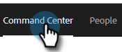

1. Click **Emails**.

   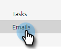

1. Choose your applicable tab.

   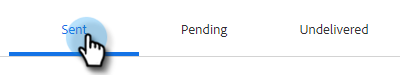

1. Click Advanced Search.

   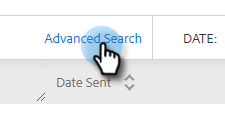

## Filters {#filters}

**Date**

Choose the date range for your search. Preset dates update depending on the email status you choose (Sent, Undelivered, Pending).

   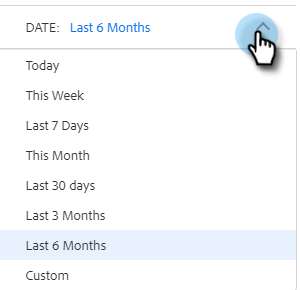

**Who**

Filter by email recipient/sender in the Who section.

   

<table>
 <tr>
  <td><strong>Drop-down</strong></td>
  <td><strong>Description</strong></td>
 </tr>
 <tr>
  <td><strong>View As</strong></td>
  <td>Filter by a specific sender in your Sales Connect instance (this option is available to Admins only).</td>
 </tr>
 <tr>
  <td><strong>By Group</strong></td>
  <td>Filter emails by a specific group of recipients.</td>
 </tr>
 <tr>
  <td><strong>By Person</strong></td>
  <td>Filter by a specific recipient.</td>
 </tr>
</table>

**When**

Choose by date created, date delivered, date failed, or date scheduled. Available options change depending on the email status you choose (Sent, Undelivered, Pending).

   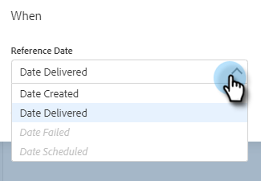

**Campaigns**

Filter emails by campaign participation.

   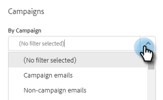

**Status**

There are three email statuses to choose from. The type/activity options change based on the status selected.

   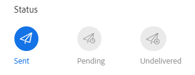

_**Status: Sent**_

   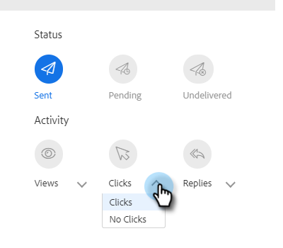

Filters by your sent email activity. You can choose views/no views, clicks/no clicks, and/or replies/no replies.

_**Status: Pending**_

   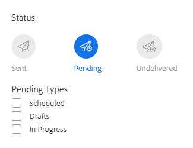

Filters by all pending emails.

<table>
 <tr>
  <td><strong>Status</strong></td>
  <td><strong>Description</strong></td>
 </tr>
 <tr>
  <td><strong>Scheduled</strong></td>
  <td>Emails that have been scheduled from the compose window (Salesforce or the Web App), email plug-ins, or a campaign.</td>
 </tr>
 <tr>
  <td><strong>Drafts</strong></td>
  <td>Emails that are currently in draft state. Emails require a subject line and a recipient in order to be saved as a draft.</td>
 </tr>
 <tr>
  <td><strong>In Progress</strong></td>
  <td>Emails that are in the process of being sent. Emails should not remain in this state for more than a few seconds.</td>
 </tr>
</table>

_**Status: Undelivered**_

   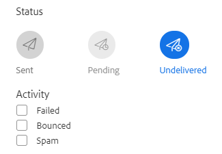

Filters by emails that were never delivered.

<table>
 <tr>
  <td><strong>Status</strong></td>
  <td><strong>Description</strong></td>
 </tr>
 <tr>
  <td><strong>Failed</strong></td>
  <td>When an email fails to send from Sales Connect (common reasons include: emails being sent to unsubscribed/blocked contacts, or if there was an issue populating the dynamic fields).</td>
 </tr>
 <tr>
  <td><strong>Bounced</strong></td>
  <td>An email is marked as bounced when it is rejected by the recipient’s server. Only emails that were sent via Sales Connect servers will be shown here.</td>
 </tr>
 <tr>
  <td><strong>Spam</strong></td>
  <td>When the email was marked as spam (common term for unsolicited email) by the recipient. Only emails that were sent via Sales Connect servers will be shown here.</td>
 </tr>
</table>

## Saved Searches {#saved-searches}

Here’s how to create a saved search.

1. After all of your filters are in place, click **Save Filters As**.

   

1. Give your search a name and click **Save**.

   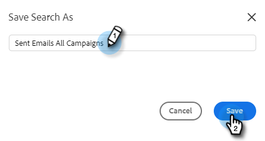

Your saved searches will be in the sidebar on the left.

   
