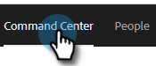
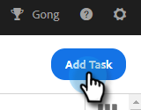
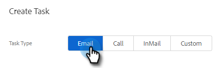
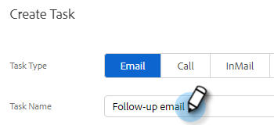
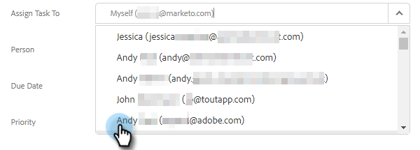
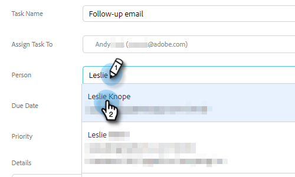
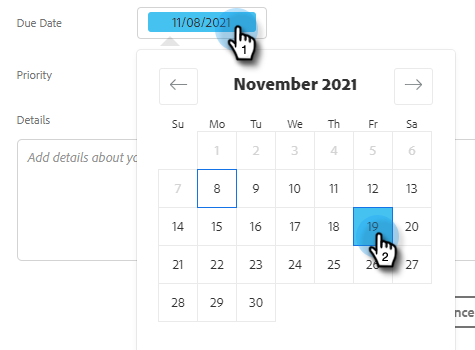
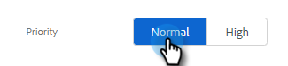
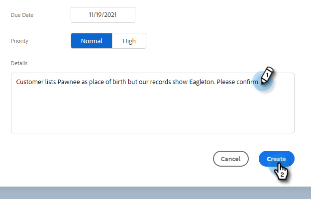

# Assigning Tasks to Team Members {#assigning-tasks-to-team-members}

If you want to collaborate with other team members, assigning tasks can be a great way to coordinate your prospecting efforts.

>[!NOTE]
>
>You can only assign tasks for shared contacts.

1. In the web application, click **[!UICONTROL Command Center]**.

   

1. Click **[!UICONTROL Add Task]**.

   

1. Select the task type.

   

1. Give your task a name.

   

1. Select the person on your team you want to assign the task to in the Assign Task field.

   

1. Add the person you want to reach out to in the person field.

   

1. Select the Due Date.

   

1. Set the Priority.

   

1. Add any important details that are relevant for your teammate (optional), and click **[!UICONTROL Create]**.

   
