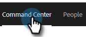
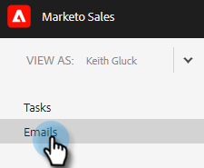
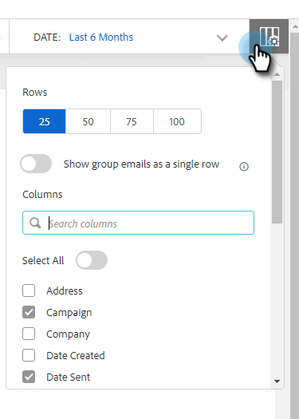

# Email Columns and Email Page Layout {#email-columns-and-email-page-layout}

You can configure any of the available columns to be visible in the email section of the [Command Center](/help/marketo/product-docs/marketo-sales-insight/actions/email/command-center/command-center-overview.md). Your configuration settings will be saved for each email subfolder (e.g., Delivered, Failed, Scheduled, etc,).

## Email Columns {#email-columns}

<table> 
 <colgroup> 
  <col> 
  <col> 
 </colgroup> 
 <tbody> 
  <tr> 
   <th>Column</th> 
   <th>Description</th> 
  </tr> 
  <tr> 
   <td><strong>Person</td> 
   <td>Name and email of person in Sales Connect. Clicking on this field will open the About tab in the person details view.</td> 
  </tr> 
  <tr> 
   <td><strong>Name</td> 
   <td>Name of the person in Sales Connect.</td> 
  </tr> 
  <tr> 
   <td><strong>Address</td> 
   <td>Primary email address of the person in Sales Connect.</td> 
  </tr> 
  <tr> 
   <td><strong>Campaign</td> 
   <td>If the email was sent as part of a campaign, this will show the name of the campaign. Clicking on this field will take you to the setup page of that campaign.</td> 
  </tr> 
  <tr> 
   <td><strong>Template</td> 
   <td>Shows the name of the template (if the email was sent with one).</td> 
  </tr> 
  <tr> 
   <td><strong>Subject</td> 
   <td>Subject line of the email.</td> 
  </tr> 
  <tr> 
   <td><strong>Groups</td> 
   <td>Shows the groups the email recipient belongs to.</td> 
  </tr> 
  <tr> 
   <td><strong>Job Title</td> 
   <td>Title of the email recipient.</td> 
  </tr> 
  <tr> 
   <td><strong>Company</td> 
   <td>Company of the email recipient.</td> 
  </tr> 
  <tr> 
   <td><strong>Email Status</td> 
   <td>Status that email is in. Statuses include: Draft, Scheduled, In Progress, Spam, Bounced, Failed, Sent. Sent emails will show an activity stream that shows how many views, clicks, and replies have taken place on that email.</td> 
  </tr> 
  <tr> 
   <td><strong>Date Created</td> 
   <td>Date the email was created.</td> 
  </tr> 
  <tr> 
   <td><strong>Last Updated</td> 
   <td>Date the email was last updated.</td> 
  </tr> 
  <tr> 
   <td><strong>Delivery Channel</td> 
   <td>The name of the delivery channel that was used for sending the email.</td> 
  </tr> 
  <tr> 
   <td><strong>Latest Activity</td> 
   <td>The last engagement by the email recipient (e.g., view, click, or reply).</td> 
  </tr> 
  <tr> 
   <td><strong>Date Sent</td> 
   <td>The date the email was sent.</td> 
  </tr> 
  <tr> 
   <td><strong>Follow Up Actions</td> 
   <td>Quick action buttons that can be used for follow-up by email, phone, inMail, or task.</td> 
  </tr> 
  <tr> 
   <td><strong>Group Email</td> 
   <td>Displays a check mark if the email was sent as part of a Group Email.</td> 
  </tr> 
  <tr> 
   <td><strong>Task Due Date</td> 
   <td>Shows the due date of tasks that are related to the email. Tasks can be related to an email by being created from the quick action buttons in the email list.</td> 
  </tr> 
  <tr> 
   <td><strong>Email Action</td> 
   <td>Quick action buttons that can be used to take action on the email. Depending on the status of the email the following actions may be available: Archive, Success, Delete, Retry Send, Unarchive.</td> 
  </tr> 
  <tr> 
   <td><strong>Task Type</td> 
   <td>Shows the task type of a task that is related to the email. Tasks can be related to an email by being created from the quick action buttons in the email list.</td> 
  </tr> 
  <tr> 
   <td><strong>Date Failed</td> 
   <td>Shows the date that the email failed if the email was not delivered.</td> 
  </tr> 
 </tbody> 
</table>

## Email Page Layout Settings {#email-page-layout-settings}

You can configure your layout by following these steps.

1. In the web application, click **Command Center**.

   

1. Select the **Emails** section.

   

1. Click the configuration button. Your options include: choosing how many rows you want, selecting what fields you want to appear, and selecting if you want group emails to be rolled up into a single item in the grid (or if you want all emails that are part of an email grid to be displayed as a single item).

   

1. Simply click outside of the configuration box when done to save the changes.
