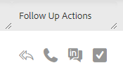

# Quick Actions in the Command Center {#quick-actions-in-the-command-center}

There are two types of quick action columns that exist in the email grid. Email Actions, which allows you to take action on the email, and Follow Up Actions, which allows you to take engagement actions with a few quick clicks.

## Quick Actions {#quick-actions}

Email quick actions are dynamic and update depending on the most relevant actions for the status of the email you're looking at. There are a maximum of two email quick actions visible for each email status. You can see what email quick actions will be available for each status below.

**Delivered**

| Status | Description |
|---|---|
| Archive |Will add the email to the archived folder and stop all disable view and click tracking for that email. |
| Success |Will mark the email as successful to be reported on in template analytics. |

**Archived**

<table> 
 <colgroup> 
  <col> 
  <col> 
 </colgroup> 
 <tbody> 
  <tr> 
   <td>Unarchive</td> 
   <td>Will move the email back to the delivered folder and reactivate view/click tracking.</td> 
  </tr> 
  <tr> 
   <td>Delete</td> 
   <td>
Will delete the email. <strong>Note:</strong> Emails that were sent as a part of a campaign cannot be deleted.
</td> 
  </tr> 
 </tbody> 
</table>

**Draft and Scheduled**

<table> 
 <colgroup> 
  <col> 
  <col> 
 </colgroup> 
 <tbody> 
  <tr> 
   <td>Edit</td> 
   <td>Will open the email in the compose window to be edited.</td> 
  </tr> 
  <tr> 
   <td>Delete</td> 
   <td>
Will delete the email. <strong>Note:</strong> Emails that were sent as a part of a campaign cannot be deleted.
</td> 
  </tr> 
 </tbody> 
</table>

**Failed, Bounced, and Spam**

<table> 
 <colgroup> 
  <col> 
  <col> 
 </colgroup> 
 <tbody> 
  <tr> 
   <td>Retry Send</td> 
   <td>Will immediately attempt to resend the email.</td> 
  </tr> 
  <tr> 
   <td>Delete</td> 
   <td>
Will delete the email. <strong>Note:</strong> Emails that were sent as a part of a campaign cannot be deleted.
</td> 
  </tr> 
 </tbody> 
</table>

**Follow-up Actions**

| Function | Description |
|---|---|
| Send Follow Up Email |Opens the compose window with the selected inline email body appended and ready to be sent to the recipient. |
| Make Call |Opens the sales phone to make a call to the email recipient. |
| Send InMail |Redirects to LinkedIn to send the person an InMail message. |
| Create Task |Opens the create task pop-up to create a reminder task. |
