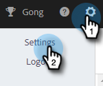
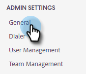
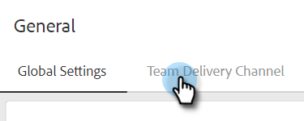
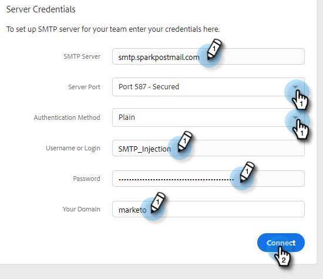

# Set up a Custom Delivery Channel for Your Team {#set-up-a-custom-delivery-channel-for-your-team}

>[!NOTE]
>
>**Admin Permissions Required**

>[!NOTE]
>
>* In addition to setting up your SMTP server, your [email identity has to be verified](/help/marketo/product-docs/marketo-sales-insight/actions/getting-started/email-settings/verify-your-email.md) before you can send emails.
>* We recommend working with your IT team or SMTP server vendor to get the right server credentials for your SMTP server.
>* You cannot connect your Gmail and Exchange server using the SMTP server credentials. Please use our Email Connection service to integrate with these providers.

1. Click the gear icon and choose **Settings**.

   

1. Under Admin Settings, click **General**.

   

1. Click the **Team Delivery Channel** tab.

   

1. Enter your SMTP Server credentials and click **Connect**.

   

   >[!NOTE]
   >
   >The Team SMTP Server will be the default delivery channel of the default email identity for all team members. Additionally, it will be available as a delivery channel option for all other email identities.

   >[!MORELIKETHIS]
   >
   >* [Email Connection for Gmail Users](/help/marketo/product-docs/marketo-sales-connect/email-plugins/gmail/email-connection-for-gmail-users.md)
   >* [Email Connection for Outlook Users](/help/marketo/product-docs/marketo-sales-connect/email-plugins/msc-for-outlook/email-connection-for-outlook-users.md)
