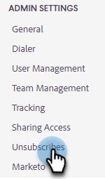
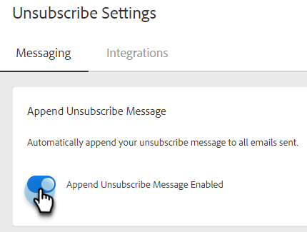

# Auto-Append Unsubscribe Message Setting {#auto-append-unsubscribe-message-setting}

Ensure every Sales Insight Actions email sent includes an unsubscribe message so recipients have an easy option to opt out of communication. When append unsubscribe message is enabled, all communication your team sends from Marketo Sales will include an unsubscribe message, including emails sent from the web application and Salesforce.
 
>[!NOTE]
>
>If you use the `{{team_unsubscribe}}` dynamic field in an email template and the unsubscribe message append setting is enabled, the team unsubscribe dynamic field will populate your unsubscribe message _instead of_ appending your unsubscribe message.

## Enable/Disable Unsubscribe Append {#enable-disable-unsubscribe-append}

1. Click the gear icon and select **Settings**.

   

1. Under Admin Settings, Click **Unsubscribes**.

   

1. In the Messaging tab, under Append Unsubscribe Message, move the slider to the desired state.

   

>[!TIP]
>
>If you disable the append unsubscribe message setting, we recommend adding an unsubscribe footer to your templates to ensure your communication has an opt-out option. You can do this by adding your own custom message to each template, or by using the `{{team_unsubscribe}}` [dynamic field](/help/marketo/product-docs/marketo-sales-insight/actions/templates/dynamic-fields.md){target="_blank"}.
