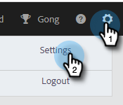
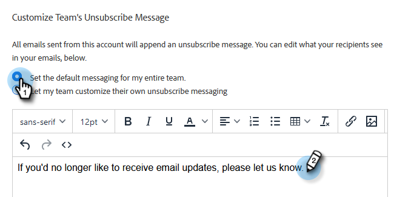
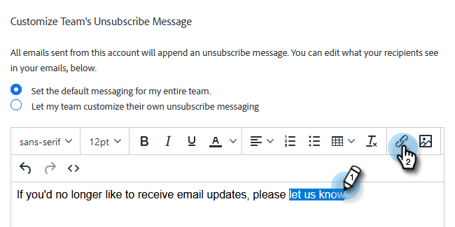
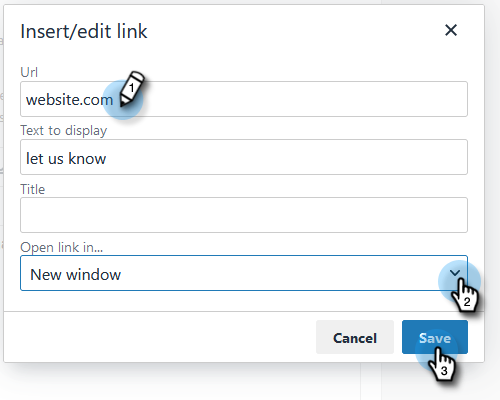
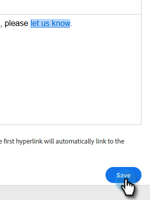

# Customize Unsubscribe Link Message {#customize-unsubscribe-link-message}

We have always allowed teams to customize their unsubscribe link messaging, but Admins have the option of setting the unsubscribe link messaging for their entire team to ensure consistent messaging.

>[!NOTE]
>
>You cannot use a third party unsubscribe link with [!DNL Marketo Sales] as this information will not be captured back into our database.

1. Click the gear icon and select **[!UICONTROL Settings]**.

   

1. Under [!UICONTROL Admin Settings], click **[!UICONTROL Unsubscribes]**.

   

1. Determine if this message will be the default for your entire team, or if you want to let the team create their own messaging (in this example, we're choosing default messaging). Write out your custom messaging in the text box.

   

1. Highlight the text you want people to click on to get to your unsubscribe page, then click the link icon.

   

   >[!NOTE]
   >
   >It doesn't matter what URL you enter. When the email is sent the first (or only) hyperlink will automatically link to the default unsubscribe page.

1. Enter a URL, determine if you want the link to open in the current or a new window, and click **[!UICONTROL Save]**.

   

1. Click **[!UICONTROL Save]** at the bottom to save your changes.

   
